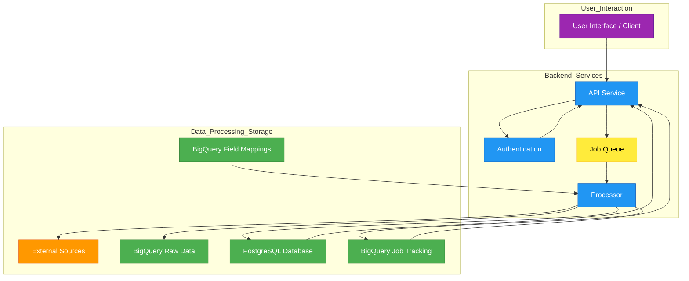

**Userport v2**

**Introduction**

Userport is a multi-tenant platform designed to manage sales accounts and leads, enriched with data from various external sources. It leverages a PostgreSQL database for core relational data, BigQuery for storing raw enrichment data and managing enrichment jobs, and a background processing system for handling data fetching and enrichment tasks asynchronously. This document outlines the system architecture, database schemas, and API design.

*(Date: March 26, 2025)*

**System Architecture**



* **API Service:** Handles incoming HTTP requests, authentication, validation, and interacts with the PostgreSQL database for synchronous operations. Enqueues background jobs for longer tasks like data enrichment.
* **Job Queue:** Manages asynchronous tasks, ensuring requests like bulk imports or enrichment are processed reliably in the background.
* **Processor:** Background workers that dequeue jobs, interact with External Sources, process data, store raw results in BigQuery, and update the primary PostgreSQL database with enriched/processed information.
* **PostgreSQL:** The primary relational database storing core application data (tenants, users, products, accounts, leads, custom columns).
* **BigQuery:** Used as a data warehouse/staging area for raw enrichment data, tracking enrichment job statuses, and potentially storing field mapping configurations.
* **External Sources:** Third-party APIs or data providers used for enriching account and lead information.

**PostgreSQL Database Design**

*Conventions:*
* Primary Keys are `UUID` type, auto-generated unless specified otherwise.
* Timestamps (`created_at`, `updated_at`) use `TIMESTAMP WITH TIME ZONE` and default to `NOW()`. `updated_at` should auto-update on record changes.
* Foreign key constraints default to `ON DELETE RESTRICT` unless otherwise specified.
* Indexes should be added to foreign keys and frequently queried columns (e.g., `tenant_id`, `email`, `status`).

*ENUM Types:*

```sql
CREATE TYPE user_role AS ENUM ('user', 'tenant_admin', 'internal_cs', 'internal_admin');
CREATE TYPE user_status AS ENUM ('pending_verification', 'active', 'inactive', 'suspended');
CREATE TYPE tenant_status AS ENUM ('active', 'inactive', 'suspended');
CREATE TYPE enrichment_status AS ENUM ('pending', 'in_progress', 'completed', 'failed');
CREATE TYPE entity_type AS ENUM ('account', 'lead');
CREATE TYPE custom_column_data_type AS ENUM ('text', 'number', 'boolean', 'date', 'url', 'email', 'json');
```

### Tenants Table

*Stores information about each client organization.*

| Column     | Type                     | Modifiers                           | Description                                  |
| :--------- | :----------------------- | :---------------------------------- | :------------------------------------------- |
| id         | UUID                     | PRIMARY KEY DEFAULT gen_random_uuid() | Unique identifier for the tenant             |
| name       | VARCHAR(255)             | NOT NULL                            | Tenant's legal or display name               |
| domain     | VARCHAR(255)             | NOT NULL UNIQUE                     | Tenant's unique domain identifier (for login) |
| status     | tenant\_status           | NOT NULL DEFAULT 'active'           | Current status of the tenant account         |
| settings   | JSONB                    |                                     | Tenant-specific configuration (e.g., integrations) |
| created_at | TIMESTAMP WITH TIME ZONE | NOT NULL DEFAULT NOW()              | Timestamp of tenant creation                 |
| updated_at | TIMESTAMP WITH TIME ZONE | NOT NULL DEFAULT NOW()              | Timestamp of last tenant update              |

*Indexes:* `domain`, `status`

### Users Table

*Stores user accounts associated with tenants.*

| Column        | Type                     | Modifiers                           | Description                                  |
| :------------ | :----------------------- | :---------------------------------- | :------------------------------------------- |
| id            | UUID                     | PRIMARY KEY DEFAULT gen_random_uuid() | Unique identifier for the user               |
| tenant_id     | UUID                     | NOT NULL REFERENCES tenants(id)     | Foreign key linking user to their tenant     |
| email         | VARCHAR(255)             | NOT NULL                            | User's email address (login identifier)    |
| password_hash | VARCHAR(255)             | NOT NULL                            | Securely hashed user password                |
| first_name    | VARCHAR(100)             |                                     | User's first name                            |
| last_name     | VARCHAR(100)             |                                     | User's last name                             |
| role          | user\_role               | NOT NULL DEFAULT 'user'             | User's role within the tenant/platform       |
| status        | user\_status             | NOT NULL DEFAULT 'pending_verification' | User's account status                        |
| last_login_at | TIMESTAMP WITH TIME ZONE |                                     | Timestamp of the user's last login         |
| created_at    | TIMESTAMP WITH TIME ZONE | NOT NULL DEFAULT NOW()              | Timestamp of user creation                   |
| updated_at    | TIMESTAMP WITH TIME ZONE | NOT NULL DEFAULT NOW()              | Timestamp of last user update                |

*Indexes:* `tenant_id`, `email`, `role`, `status`
*Constraints:* `UNIQUE (tenant_id, email)`

### Products Table

*Stores products or services defined by tenants, around which accounts and leads are organized.*

| Column          | Type                     | Modifiers                           | Description                             |
| :-------------- | :----------------------- | :---------------------------------- | :-------------------------------------- |
| id              | UUID                     | PRIMARY KEY DEFAULT gen_random_uuid() | Unique identifier for the product         |
| tenant_id       | UUID                     | NOT NULL REFERENCES tenants(id)     | Foreign key linking product to its tenant |
| name            | VARCHAR(255)             | NOT NULL                            | Name of the product/service             |
| description     | TEXT                     |                                     | Detailed description of the product     |
| icp_description | TEXT                     |                                     | Description of the Ideal Customer Profile |
| keywords        | TEXT[]                   |                                     | Array of keywords related to the product  |
| settings        | JSONB                    |                                     | Product-specific settings/configuration |
| created_by      | UUID                     | REFERENCES users(id) ON DELETE SET NULL | User who created the product            |
| created_at      | TIMESTAMP WITH TIME ZONE | NOT NULL DEFAULT NOW()              | Timestamp of product creation           |
| updated_at      | TIMESTAMP WITH TIME ZONE | NOT NULL DEFAULT NOW()              | Timestamp of last product update        |

*Indexes:* `tenant_id`, `name`, `created_by`
*Constraints:* `UNIQUE (tenant_id, name)`

### Accounts Table

*Stores information about companies (accounts) relevant to a specific product.*

| Column             | Type                     | Modifiers                           | Description                                  |
| :----------------- | :----------------------- | :---------------------------------- | :------------------------------------------- |
| id                 | UUID                     | PRIMARY KEY DEFAULT gen_random_uuid() | Unique identifier for the account            |
| tenant_id          | UUID                     | NOT NULL REFERENCES tenants(id)     | Foreign key linking account to its tenant    |
| product_id         | UUID                     | NOT NULL REFERENCES products(id) ON DELETE CASCADE | Foreign key linking account to its product |
| name               | VARCHAR(255)             | NOT NULL                            | Company name                                 |
| website            | VARCHAR(512)             |                                     | Company's primary website URL                |
| linkedin_url       | VARCHAR(512)             |                                     | LinkedIn company page URL                    |
| industry           | VARCHAR(255)             |                                     | Primary industry of the company              |
| location           | VARCHAR(255)             |                                     | Company headquarters or primary location     |
| employee_count     | INTEGER                  |                                     | Estimated number of employees                |
| company_type       | VARCHAR(100)             |                                     | e.g., Public, Private, Non-profit          |
| founded_year       | INTEGER                  |                                     | Year the company was founded                 |
| technologies       | JSONB                    |                                     | Technology stack used by the company         |
| funding_details    | JSONB                    |                                     | Information about funding rounds, amounts    |
| enrichment_status  | enrichment\_status       | NOT NULL DEFAULT 'pending'          | Status of the latest enrichment process      |
| enrichment_sources | JSONB                    |                                     | Status per enrichment source (e.g., `{"linkedin": "completed", "clearbit": "failed"}`) |
| last_enriched_at   | TIMESTAMP WITH TIME ZONE |                                     | Timestamp of the last successful enrichment  |
| custom_fields      | JSONB                    |                                     | Stores values for tenant-defined custom columns (key: custom_column_id or name, value: data) |
| created_by         | UUID                     | REFERENCES users(id) ON DELETE SET NULL | User who created the account record        |
| created_at         | TIMESTAMP WITH TIME ZONE | NOT NULL DEFAULT NOW()              | Timestamp of account creation                |
| updated_at         | TIMESTAMP WITH TIME ZONE | NOT NULL DEFAULT NOW()              | Timestamp of last account update             |

*Indexes:* `tenant_id`, `product_id`, `name`, `website`, `linkedin_url`, `enrichment_status`, `created_by`

### Leads Table

*Stores information about individuals (leads) associated with an account.*

| Column            | Type                     | Modifiers                           | Description                                      |
| :---------------- | :----------------------- | :---------------------------------- | :----------------------------------------------- |
| id                | UUID                     | PRIMARY KEY DEFAULT gen_random_uuid() | Unique identifier for the lead                   |
| tenant_id         | UUID                     | NOT NULL REFERENCES tenants(id)     | Foreign key linking lead to its tenant           |
| account_id        | UUID                     | NOT NULL REFERENCES accounts(id) ON DELETE CASCADE | Foreign key linking lead to its account        |
| first_name        | VARCHAR(100)             |                                     | Lead's first name                                |
| last_name         | VARCHAR(100)             |                                     | Lead's last name                                 |
| title             | VARCHAR(255)             |                                     | Lead's job title                                 |
| linkedin_url      | VARCHAR(512)             | UNIQUE                              | Lead's LinkedIn profile URL                      |
| email             | VARCHAR(255)             |                                     | Lead's professional email address              |
| phone             | VARCHAR(50)              |                                     | Lead's phone number                              |
| enrichment_status | enrichment\_status       | NOT NULL DEFAULT 'pending'          | Status of the latest enrichment process          |
| enrichment_data   | JSONB                    |                                     | Cache of recent raw/processed enrichment data    |
| linkedin_activity | JSONB                    |                                     | Recent LinkedIn activity (e.g., posts, comments) |
| score             | FLOAT                    |                                     | Calculated score indicating lead potential       |
| last_enriched_at  | TIMESTAMP WITH TIME ZONE |                                     | Timestamp of the last successful enrichment      |
| custom_fields     | JSONB                    |                                     | Stores values for tenant-defined custom columns  |
| created_by        | UUID                     | REFERENCES users(id) ON DELETE SET NULL | User who created the lead record               |
| created_at        | TIMESTAMP WITH TIME ZONE | NOT NULL DEFAULT NOW()              | Timestamp of lead creation                       |
| updated_at        | TIMESTAMP WITH TIME ZONE | NOT NULL DEFAULT NOW()              | Timestamp of last lead update                    |

*Indexes:* `tenant_id`, `account_id`, `linkedin_url`, `email`, `enrichment_status`, `score`, `created_by`

### Custom Columns Table

*Defines tenant-specific fields for Accounts or Leads.*

| Column             | Type                     | Modifiers                           | Description                                      |
| :----------------- | :----------------------- | :---------------------------------- | :----------------------------------------------- |
| id                 | UUID                     | PRIMARY KEY DEFAULT gen_random_uuid() | Unique identifier for the custom column          |
| tenant_id          | UUID                     | NOT NULL REFERENCES tenants(id)     | Foreign key linking column to its tenant         |
| product_id         | UUID                     | NOT NULL REFERENCES products(id) ON DELETE CASCADE | Foreign key linking column to its product    |
| entity_type        | entity\_type             | NOT NULL                            | The entity this column applies to (account/lead) |
| name               | VARCHAR(255)             | NOT NULL                            | Display name of the custom column                |
| description        | TEXT                     |                                     | Optional description of the column's purpose   |
| data_type          | custom\_column\_data\_type | NOT NULL                            | The data type of the column's value            |
| enrichment_mapping | JSONB                    |                                     | Rules for mapping data from enrichment sources |
| enrichment_query   | TEXT                     |                                     | Prompt or query for AI-based enrichment        |
| created_by         | UUID                     | REFERENCES users(id) ON DELETE SET NULL | User who created the custom column             |
| created_at         | TIMESTAMP WITH TIME ZONE | NOT NULL DEFAULT NOW()              | Timestamp of column creation                   |
| updated_at         | TIMESTAMP WITH TIME ZONE | NOT NULL DEFAULT NOW()              | Timestamp of last column update                |

*Indexes:* `tenant_id`, `product_id`, `entity_type`, `name`
*Constraints:* `UNIQUE (product_id, entity_type, name)`

### Enrichment Logs Table

*Logs the outcome of individual enrichment attempts.*

| Column         | Type                     | Modifiers                           | Description                                         |
| :------------- | :----------------------- | :---------------------------------- | :-------------------------------------------------- |
| id             | UUID                     | PRIMARY KEY DEFAULT gen_random_uuid() | Unique identifier for the log entry                 |
| tenant_id      | UUID                     | NOT NULL REFERENCES tenants(id)     | Tenant associated with the enrichment             |
| job_id         | VARCHAR(255)             |                                     | Optional reference to a BigQuery job ID             |
| entity_type    | entity\_type             | NOT NULL                            | Type of entity being enriched (account/lead)        |
| entity_id      | UUID                     | NOT NULL                            | ID of the specific Account or Lead record           |
| source         | VARCHAR(100)             | NOT NULL                            | The data source used (e.g., 'linkedin', 'clearbit', 'ai_custom_column') |
| status         | enrichment\_status       | NOT NULL                            | Outcome of this specific enrichment attempt         |
| fields_updated | TEXT[]                   |                                     | List of fields updated in Postgres by this attempt |
| error_details  | JSONB                    |                                     | Details if the enrichment attempt failed            |
| processed_at   | TIMESTAMP WITH TIME ZONE | NOT NULL DEFAULT NOW()              | Timestamp when the enrichment attempt was processed |
| created_at     | TIMESTAMP WITH TIME ZONE | NOT NULL DEFAULT NOW()              | Timestamp when the log entry was created (job start) |

*Indexes:* `tenant_id`, `job_id`, `entity_type`, `entity_id`, `source`, `status`, `processed_at`

**BigQuery Tables**

*Purpose:* Store raw data from external sources, track batch job statuses, and potentially manage complex mapping rules. This decouples raw data ingestion from the main application database.

### Account Enrichment Data (Example)

*Stores raw responses from external sources for accounts.*

| Column          | Type          | Description                                       |
| :-------------- | :------------ | :------------------------------------------------ |
| record_id       | STRING        | Unique identifier for this raw data record        |
| account_id      | STRING        | References PostgreSQL `accounts.id` (as STRING)   |
| tenant_id       | STRING        | References PostgreSQL `tenants.id` (as STRING)    |
| source          | STRING        | Data source (e.g., 'linkedin', 'clearbit', 'apollo') |
| company_name    | STRING        | Company name as returned by the source            |
| employee_count  | INTEGER       | Employee count from the source                    |
| industry        | STRING        | Industry information from the source              |
| location        | STRING        | Location information from the source              |
| website         | STRING        | Website URL from the source                       |
| linkedin_url    | STRING        | LinkedIn URL from the source                      |
| technologies    | ARRAY<STRING> | Tech stack information from the source            |
| funding_details | JSON          | Funding information (as JSON string or STRUCT)    |
| raw_data        | JSON          | Complete raw JSON response from the source        |
| fetched_at      | TIMESTAMP     | Timestamp when the data was fetched from the source |
| bq_loaded_at    | TIMESTAMP     | Timestamp when the data was loaded into BigQuery  |

### Lead Enrichment Data (Example)

*Stores raw responses from external sources for leads.*

| Column             | Type      | Description                                       |
| :----------------- | :-------- | :------------------------------------------------ |
| record_id          | STRING    | Unique identifier for this raw data record        |
| lead_id            | STRING    | References PostgreSQL `leads.id` (as STRING)      |
| account_id         | STRING    | References PostgreSQL `accounts.id` (as STRING)   |
| tenant_id          | STRING    | References PostgreSQL `tenants.id` (as STRING)    |
| source             | STRING    | Data source (e.g., 'linkedin', 'clearbit', 'apollo') |
| first_name         | STRING    | First name from the source                        |
| last_name          | STRING    | Last name from the source                         |
| title              | STRING    | Job title from the source                         |
| email              | STRING    | Email address from the source                     |
| phone              | STRING    | Phone number from the source                      |
| linkedin_url       | STRING    | LinkedIn profile URL from the source              |
| employment_history | JSON      | Employment history (as JSON string or ARRAY<STRUCT>) |
| education          | JSON      | Education details (as JSON string or ARRAY<STRUCT>)  |
| raw_data           | JSON      | Complete raw JSON response from the source        |
| fetched_at         | TIMESTAMP | Timestamp when the data was fetched from the source |
| bq_loaded_at       | TIMESTAMP | Timestamp when the data was loaded into BigQuery  |

### Enrichment Jobs

*Tracks the status of batch enrichment or processing jobs.*

| Column        | Type          | Description                                            |
| :------------ | :------------ | :----------------------------------------------------- |
| job_id        | STRING        | Unique identifier for the enrichment job (e.g., UUID) |
| tenant_id     | STRING        | References PostgreSQL `tenants.id`                     |
| status        | STRING        | 'pending', 'processing', 'completed', 'failed'         |
| entity_type   | STRING        | 'account', 'lead', 'custom_column'                     |
| entity_ids    | ARRAY<STRING> | List of PostgreSQL entity IDs involved in the job      |
| sources       | ARRAY<STRING> | List of data sources requested for enrichment        |
| custom_column_id | STRING   | Optional: ID of the custom column being enriched       |
| created_at    | TIMESTAMP     | Timestamp when the job was requested/created         |
| updated_at    | TIMESTAMP     | Timestamp of the last status update                    |
| started_at    | TIMESTAMP     | Timestamp when processing actually began               |
| completed_at  | TIMESTAMP     | Timestamp when the job finished (successfully or not)  |
| error_details | JSON          | Details if the job failed                              |

### Field Mappings (Optional - Can be managed in PG or config)

*Defines how data from `Source Enrichment Data` tables maps to PostgreSQL fields.*

| Column              | Type    | Description                                               |
| :------------------ | :------ | :-------------------------------------------------------- |
| mapping_id          | STRING  | Unique ID for the mapping rule                            |
| tenant_id           | STRING  | Apply to a specific tenant, or NULL for global mapping    |
| source              | STRING  | Data source this mapping applies to                       |
| entity_type         | STRING  | 'account' or 'lead'                                       |
| source_field_path   | STRING  | Path to the field in the BQ raw_data JSON (e.g., `company.name`) |
| target_field        | STRING  | Name of the field in the PostgreSQL table (`accounts` or `leads`) |
| transformation_rule | STRING  | Optional: Rule/function for data transformation (e.g., 'toUpperCase', 'extractYear') |
| priority            | INTEGER | Order of application if multiple sources update the same field (lower number = higher priority) |
| enabled             | BOOLEAN | Whether this mapping rule is active                       |
| created_at          | TIMESTAMP | Timestamp mapping created                             |
| updated_at          | TIMESTAMP | Timestamp mapping last updated                        |

**API Design**

*Conventions:*
* Base URL: `/api/v1`
* Authentication: Bearer Token in `Authorization` header for protected endpoints.
* Request/Response Body: JSON.
* Timestamps: ISO 8601 format in UTC (e.g., `2025-03-26T10:30:00Z`).
* UUIDs: Represented as strings in JSON.
* Asynchronous Operations: Endpoints triggering background jobs typically return `202 Accepted` with a `task_id` or `job_id`. A separate endpoint (`GET /api/v1/tasks/{task_id}` or `GET /api/v1/jobs/{job_id}`) should be used to check the status.

### Common Components

* **Authorization Header:**
    * `Authorization: Bearer <JWT_TOKEN>` (Required for most endpoints after login)
* **Pagination Parameters (for GET list endpoints):**
    * `page` (Integer, default: 1)
    * `page_size` (Integer, default: 20, max: 100)
* **Sorting Parameters (for GET list endpoints):**
    * `sort_by` (String, e.g., `created_at`, `name`, `score`)
    * `sort_order` (String, `asc` or `desc`, default: `asc` or `desc` depending on context)
* **Filtering Parameters:** Specific to each list endpoint (e.g., `status`, `name`).

### Authentication (`/auth`)

#### `POST /auth/login`
* Authenticates a user based on email, password, and tenant domain.
* **Request:** (See original)
* **Success (200 OK):** (See original, include roles in user object)
    ```json
    {
      "token": "...",
      "user": {
        "id": "...", "email": "...", "first_name": "...", "last_name": "...", "role": "tenant_admin" // Example role
      }
    }
    ```
* **Errors:** 400 (Validation), 401 (Auth Failed), 404 (Tenant Not Found)

#### `POST /auth/logout`
* Invalidates the user's session/token (implementation dependent, often requires token blocklist).
* **Headers:** `Authorization: Bearer <token>`
* **Success (204 No Content)**
* **Errors:** 401 (Unauthorized)

#### `POST /auth/forgot-password`
* Initiates the password reset process for a user.
* **Request:** (See original)
* **Success (200 OK):** (See original)
* **Errors:** 400 (Validation), 404 (User/Tenant Not Found)

#### `POST /auth/reset-password`
* Allows a user to set a new password using a reset token.
* **Request:** (See original)
* **Success (200 OK):** (See original)
* **Errors:** 400 (Validation - weak password), 401 (Invalid/Expired Token)

### Tenants (`/tenants`) - *Restricted Access*

*(Primarily for Internal Admins)*

#### `POST /tenants`
* Creates a new tenant and its initial admin user.
* **Restriction:** `internal_admin`
* **Request:** (See original)
* **Success (201 Created):** (See original, return full tenant object)
* **Errors:** 400 (Validation - domain exists, invalid email), 401, 403

#### `GET /tenants`
* Lists tenants (with pagination/filtering).
* **Restriction:** `internal_admin`, `internal_cs`
* **Query Params:** `page`, `page_size`, `sort_by`, `sort_order`, `status`, `name`
* **Success (200 OK):** Paginated list of tenant objects.
* **Errors:** 401, 403

#### `GET /tenants/{tenant_id}`
* Retrieves details for a specific tenant.
* **Restriction:** `internal_admin`, `internal_cs`, `tenant_admin` (only their own tenant)
* **Success (200 OK):** (See original)
* **Errors:** 401, 403, 404

#### `PATCH /tenants/{tenant_id}`
* Updates a tenant's details (e.g., name, status, settings).
* **Restriction:** `internal_admin` (for status/domain), `tenant_admin` (for name/settings)
* **Request:** (See original, allow `settings` update)
* **Success (200 OK):** (See original, return updated tenant object)
* **Errors:** 400 (Validation), 401, 403, 404

### Products (`/products`)

#### `POST /products`
* Creates a new product for the authenticated user's tenant.
* **Restriction:** `tenant_admin` (or configurable role)
* **Request:** (See original)
* **Success (201 Created):** (See original, include `tenant_id`, `created_by`)
* **Errors:** 400 (Validation - unique name), 401, 403

#### `GET /products`
* Lists products for the tenant.
* **Restriction:** Any authenticated user within the tenant.
* **Query Params:** `page`, `page_size`, `sort_by`, `sort_order`, `name`
* **Success (200 OK):** Paginated list of product objects.
    ```json
    {
      "total": 5, "page": 1, "page_size": 20,
      "products": [
        { "id": "...", "name": "...", "description": "...", ... }
      ]
    }
    ```
* **Errors:** 401

#### `GET /products/{product_id}`
* Retrieves details for a specific product.
* **Restriction:** Any authenticated user within the tenant.
* **Success (200 OK):** Full product object.
* **Errors:** 401, 404

#### `PATCH /products/{product_id}`
* Updates an existing product.
* **Restriction:** `tenant_admin` (or creator/configurable role)
* **Request:** Partial product object (name, description, icp, keywords, settings).
* **Success (200 OK):** Updated product object.
* **Errors:** 400 (Validation), 401, 403, 404

#### `DELETE /products/{product_id}`
* Deletes a product (and potentially associated accounts/leads via CASCADE). *Use with caution!*
* **Restriction:** `tenant_admin`
* **Success (204 No Content)**
* **Errors:** 401, 403, 404

### Accounts (`/accounts`)

#### `POST /accounts`
* Creates a single account associated with a product. Enrichment is triggered automatically (`status: pending`).
* **Restriction:** Authenticated users (`user`, `tenant_admin`).
* **Request:** (See original) - Include optional `custom_fields`.
    ```json
    {
      "product_id": "...",
      "name": "...",
      "linkedin_url": "...", // optional
      "website": "...",      // optional
      "custom_fields": { "custom_col_id_1": "value1", "intent_score_col_name": "Low" } // Optional
    }
    ```
* **Success (201 Created):** (See original)
* **Errors:** 400 (Validation), 401, 403, 404 (Product not found)

#### `POST /accounts/bulk`
* Creates multiple accounts in batch. Triggers background enrichment job.
* **Restriction:** Authenticated users.
* **Request:** (See original) - Allow `custom_fields` per account. Max 1000 accounts.
* **Success (202 Accepted):** Returns a `job_id` for tracking.
    ```json
    {
      "job_id": "batch-uuid-...", // ID to track the bulk creation/enrichment job
      "message": "Account creation and enrichment job accepted.",
      "submitted_count": 2 // Number of accounts submitted
    }
    ```
* **Errors:** 400 (Validation - size limit, format), 401, 403, 429 (Rate Limit)

#### `GET /accounts`
* Lists accounts for the tenant, potentially filtered by product.
* **Restriction:** Authenticated users.
* **Query Params:** `page`, `page_size`, `sort_by`, `sort_order`, `product_id`, `name`, `enrichment_status`, `industry`, etc. Allow filtering by `custom_fields`.
* **Success (200 OK):** Paginated list of account objects (including `custom_fields`).
    ```json
    {
      "total": 150, "page": 1, "page_size": 20,
      "accounts": [
        { "id": "...", "name": "...", "website": "...", "enrichment_status": "completed", "custom_fields": {...}, ... }
      ]
    }
    ```
* **Errors:** 400 (Invalid filter), 401

#### `GET /accounts/{account_id}`
* Retrieves details for a specific account, including enriched data and custom fields.
* **Restriction:** Authenticated users.
* **Success (200 OK):** (See original, ensure `custom_fields` is accurate)
* **Errors:** 401, 404

#### `PATCH /accounts/{account_id}`
* Updates an existing account. Can update standard fields or `custom_fields`.
* **Restriction:** Authenticated users.
* **Request:** Partial account object.
    ```json
    {
      "name": "New Name",
      "employee_count": 1500, // Overwrite enriched data if needed
      "custom_fields": {
        "custom_col_id_1": "new_value", // Update specific custom field
        "intent_score_col_name": null // Clear a custom field
      }
    }
    ```
* **Success (200 OK):** Updated account object.
* **Errors:** 400 (Validation), 401, 403, 404

#### `DELETE /accounts/{account_id}`
* Deletes an account (and associated leads via CASCADE).
* **Restriction:** `tenant_admin` or creator.
* **Success (204 No Content)**
* **Errors:** 401, 403, 404

### Leads (`/leads` and nested under Accounts)

#### `POST /accounts/{account_id}/leads`
* Creates a single lead associated with an account. Enrichment triggered.
* **Restriction:** Authenticated users.
* **Request:** (See original) - Include optional `custom_fields`.
* **Success (201 Created):** (See original)
* **Errors:** 400 (Validation), 401, 403, 404 (Account not found)

#### `GET /accounts/{account_id}/leads`
* Retrieves leads for a specific account.
* **Restriction:** Authenticated users.
* **Query Params:** `page`, `page_size`, `sort_by` (`score`, `last_name`, etc.), `sort_order`, `enrichment_status`, `title`, etc. Allow filtering by `custom_fields`.
* **Success (200 OK):** (See original, ensure `custom_fields` included)
* **Errors:** 401, 404 (Account not found)

#### `GET /leads/{lead_id}`
* Retrieves details for a specific lead.
* **Restriction:** Authenticated users.
* **Success (200 OK):** (See original, ensure `custom_fields` included)
* **Errors:** 401, 404

#### `PATCH /leads/{lead_id}`
* Updates an existing lead. Can update standard fields or `custom_fields`.
* **Restriction:** Authenticated users.
* **Request:** Partial lead object (similar to `PATCH /accounts/{account_id}`).
* **Success (200 OK):** Updated lead object.
* **Errors:** 400 (Validation), 401, 403, 404

#### `DELETE /leads/{lead_id}`
* Deletes a lead.
* **Restriction:** `tenant_admin` or creator.
* **Success (204 No Content)**
* **Errors:** 401, 403, 404

#### `POST /accounts/{account_id}/leads/recommend` (*AI Feature*)
* Triggers AI-based lead recommendation for an account (background task).
* **Restriction:** Authenticated users.
* **Request:** (Optional) Body might include criteria like job titles, seniority.
    ```json
    {
        "titles": ["VP Sales", "Head of Marketing"], // Optional criteria
        "count": 10 // Optional: desired number of recommendations
    }
    ```
* **Success (202 Accepted):**
    ```json
    {
      "task_id": "recommend-uuid-...", // ID to track this recommendation task
      "message": "Lead recommendation job accepted.",
      "account_id": "..."
    }
    ```
* **Errors:** 401, 404 (Account not found), 429 (Rate Limit)

### Custom Columns (`/custom-columns`)

#### `POST /custom-columns`
* Creates a new custom column definition for a product.
* **Restriction:** `tenant_admin`.
* **Request:** (See original, use `data_type` instead of `column_type`)
* **Success (201 Created):** (See original)
* **Errors:** 400 (Validation - unique name per product/entity type), 401, 403, 404 (Product not found)

#### `GET /custom-columns`
* Lists custom columns defined for the tenant, filterable by product and entity type.
* **Restriction:** Authenticated users.
* **Query Params:** `page`, `page_size`, `product_id` (required), `entity_type` (`account` or `lead`).
* **Success (200 OK):** Paginated list of custom column definitions.
* **Errors:** 400 (Missing product_id), 401

#### `GET /custom-columns/{column_id}`
* Retrieves details for a specific custom column definition.
* **Restriction:** Authenticated users.
* **Success (200 OK):** Full custom column definition object.
* **Errors:** 401, 404

#### `PATCH /custom-columns/{column_id}`
* Updates a custom column definition (e.g., description, enrichment query). *Name, entity_type, product_id, data_type usually should not be changed after creation.*
* **Restriction:** `tenant_admin`.
* **Request:** Partial definition object (description, enrichment_mapping, enrichment_query).
* **Success (200 OK):** Updated custom column definition.
* **Errors:** 400 (Validation), 401, 403, 404

#### `DELETE /custom-columns/{column_id}`
* Deletes a custom column definition. *Consider impact on existing data in `custom_fields` JSONB columns.* (Strategy needed: clear values, leave them, prevent deletion if used?).
* **Restriction:** `tenant_admin`.
* **Success (204 No Content)**
* **Errors:** 401, 403, 404, 409 (Conflict - if deletion is blocked while data exists)

#### `POST /custom-columns/{column_id}/enrich` (*AI Feature*)
* Triggers AI-based enrichment for a specific custom column for given entities (background task).
* **Restriction:** Authenticated users.
* **Request:** (See original) - Max 1000 entity_ids.
* **Success (202 Accepted):**
    ```json
    {
      "task_id": "enrich-uuid-...", // ID to track this enrichment task
      "message": "Custom column enrichment job accepted.",
      "column_id": "...",
      "entity_count": 2
    }
    ```
* **Errors:** 400 (Validation - size limit), 401, 403, 404 (Column not found), 429 (Rate Limit)

### Asynchronous Task/Job Status (`/tasks` or `/jobs`)

#### `GET /tasks/{task_id}` (or `GET /jobs/{job_id}`)
* Retrieves the status of a background task/job (bulk import, recommendation, enrichment).
* **Restriction:** User who initiated the task or `tenant_admin`.
* **Success (200 OK):**
    ```json
    {
      "id": "enrich-uuid-...", // task_id or job_id
      "status": "completed", // pending, processing, completed, failed
      "type": "custom_column_enrichment", // or bulk_account_import, lead_recommendation
      "progress": { // Optional, more detailed progress
        "processed": 50,
        "total": 100,
        "percentage": 50.0
      },
      "result_summary": { // Optional summary upon completion
        "succeeded": 98,
        "failed": 2
      },
      "error_details": null, // Or details if status is 'failed'
      "created_at": "...",
      "updated_at": "..."
    }
    ```
* **Errors:** 401, 403, 404 (Task/Job not found)

### Rate Limiting

*(See original - review limits based on expected usage and infrastructure)*
Ensure `Retry-After` header is included in 429 responses.

### Common Error Responses

*(See original - ensure `request_id` is included in 500 errors for easier debugging)*

* **400 Bad Request:** Include detailed validation errors.
* **401 Unauthorized:** Missing, invalid, or expired token.
* **403 Forbidden:** User authenticated but lacks permission for the specific action/resource.
* **404 Not Found:** Resource identified by URL parameter (e.g., `tenant_id`, `account_id`) does not exist or is not accessible by the user.
* **429 Too Many Requests:** Rate limit exceeded.
* **500 Internal Server Error:** Unexpected server-side error.

