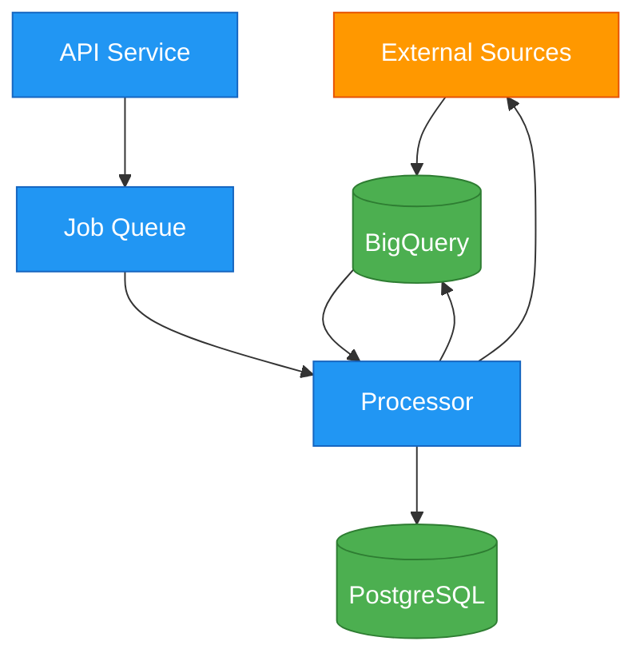

# Userport v2



## Postgres Database Design

### Tenants

| Column     | Type         | Required | Description               |
|------------|--------------|----------|---------------------------|
| id         | UUID         | Yes      | Primary key               |
| name       | VARCHAR(255) | Yes      | Tenant name               |
| domain     | VARCHAR(255) | Yes      | Tenant domain             |
| status     | VARCHAR(50)  | Yes      | active/inactive/suspended |
| settings   | JSONB        | No       | Tenant-specific settings  |
| created_at | TIMESTAMP    | Yes      | Creation timestamp        |
| updated_at | TIMESTAMP    | Yes      | Last update timestamp     |

### Users Table

| Column        | Type        | Required | Description                                                             |
|---------------|-------------|----------|-------------------------------------------------------------------------|
| id            | UUID        | Yes      | Primary key                                                             |
| tenant_id     | UUID        | Yes      | Foreign key to Tenants                                                  |
| email         | String(255) | Yes      | User's email address<br/>Must be unique within tenant                   |
| password_hash | String(255) | Yes      | Hashed password                                                         |
| first_name    | String(100) | No       | User's first name                                                       |
| last_name     | String(100) | No       | User's last name                                                        |
| role          | Enum        | Yes      | User's role<br/>Values: user, tenant_admin, internal_cs, internal_admin |
| status        | Enum        | Yes      | Account status<br/>Values: active, inactive, suspended                  |
| last_login    | Timestamp   | No       | Last login timestamp                                                    |
| created_at    | Timestamp   | Yes      | Creation timestamp                                                      |
| updated_at    | Timestamp   | Yes      | Last update timestamp                                                   |

### Products

| Column          | Type         | Required | Description               |
|-----------------|--------------|----------|---------------------------|
| id              | UUID         | Yes      | Primary key               |
| tenant_id       | UUID         | Yes      | Foreign key to Tenants    |
| name            | VARCHAR(255) | Yes      | Product name              |
| description     | TEXT         | Yes      | Product description       |
| icp_description | TEXT         | No       | Ideal Customer Profile    |
| keywords        | TEXT[]       | No       | Related keywords          |
| settings        | JSONB        | No       | Product-specific settings |
| created_by      | UUID         | No       | Foreign key to Users      |
| created_at      | TIMESTAMP    | Yes      | Creation timestamp        |
| updated_at      | TIMESTAMP    | Yes      | Last update timestamp     |

### Accounts

| Column             | Type         | Required | Description                          |
|--------------------|--------------|----------|--------------------------------------|
| id                 | UUID         | Yes      | Primary key                          |
| tenant_id          | UUID         | Yes      | Foreign key to Tenants               |
| product_id         | UUID         | Yes      | Foreign key to Products              |
| name               | VARCHAR(255) | Yes      | Company name                         |
| website            | VARCHAR(512) | No       | Company website                      |
| linkedin_url       | VARCHAR(512) | No       | LinkedIn company URL                 |
| industry           | VARCHAR(255) | No       | Industry                             |
| location           | VARCHAR(255) | No       | Location                             |
| employee_count     | INTEGER      | No       | Number of employees                  |
| company_type       | VARCHAR(100) | No       | Type of company                      |
| founded_year       | INTEGER      | No       | Year founded                         |
| technologies       | JSONB        | No       | Technology stack                     |
| funding_details    | JSONB        | No       | Funding information                  |
| enrichment_status  | VARCHAR(50)  | Yes      | pending/in_progress/completed/failed |
| enrichment_sources | JSONB        | No       | Status per source                    |
| last_enriched_at   | TIMESTAMP    | No       | Last enrichment time                 |
| custom_fields      | JSONB        | No       | Dynamic custom fields                |
| created_by         | UUID         | No       | Foreign key to Users                 |
| created_at         | TIMESTAMP    | Yes      | Creation timestamp                   |
| updated_at         | TIMESTAMP    | Yes      | Last update timestamp                |

### Leads Table

| Column            | Type        | Required | Description                                                                       |
|-------------------|-------------|----------|-----------------------------------------------------------------------------------|
| id                | UUID        | Yes      | Primary key, Auto-generated                                                       |
| tenant_id         | UUID        | Yes      | Foreign key to Tenants                                                            |
| account_id        | UUID        | Yes      | Foreign key to Accounts                                                           |
| first_name        | String(100) | No       | Lead's first name                                                                 |
| last_name         | String(100) | No       | Lead's last name                                                                  |
| title             | String(255) | No       | Job title                                                                         |
| linkedin_url      | URL(512)    | No       | LinkedIn profile URL                                                              |
| email             | String(255) | No       | Email address                                                                     |
| phone             | String(50)  | No       | Phone number                                                                      |
| enrichment_status | Enum        | Yes      | Status of enrichment<br/> Values: `pending`, `in_progress`, `completed`, `failed` |
| enrichment_data   | JSON        | No       | Raw enrichment data                                                               |
| linkedin_activity | JSON        | No       | Recent activities<br/>From Chrome extension                                       |
| score             | Float       | No       | Lead score                                                                        |
| last_enriched_at  | Timestamp   | No       | Last enrichment time                                                              |
| created_by        | UUID        | No       | Foreign key to Users                                                              |
| created_at        | Timestamp   | Yes      | Creation timestamp                                                                |
| updated_at        | Timestamp   | Yes      | Last update timestamp                                                             |

### Custom Columns Table

| Column             | Type        | Required | Description                                                                                        |
|--------------------|-------------|----------|----------------------------------------------------------------------------------------------------|
| id                 | UUID        | Yes      | Primary key                                                                                        |
| tenant_id          | UUID        | Yes      | Foreign key to Tenants                                                                             |
| product_id         | UUID        | Yes      | Foreign key to Products                                                                            |
| entity_type        | Enum        | Yes      | Type of entity<br/>Values: account, lead                                                           |
| name               | String(255) | Yes      | Column name                                                                                        |
| description        | Text        | No       | Column description                                                                                 |
| data_type          | VARCHAR(50) | Yes      | Type of data. e.g. text/number/boolean/date/json.. we can add more like email, URL etc. later on.. |
| enrichment_mapping | JSONB       | No       | Mapping to enriched data                                                                           |
| enrichment_query   | Text        | No       | AI enrichment query                                                                                |
| created_by         | UUID        | No       | Foreign key to Users                                                                               |
| created_at         | Timestamp   | Yes      | Creation timestamp                                                                                 |
| updated_at         | Timestamp   | Yes      | Last update timestamp                                                                              |

### Enrichment Logs

| Column         | Type        | Required | Description            |
|----------------|-------------|----------|------------------------|
| id             | UUID        | Yes      | Primary key            |
| tenant_id      | UUID        | Yes      | Foreign key to Tenants |
| entity_type    | VARCHAR(50) | Yes      | account/lead           |
| entity_id      | UUID        | Yes      | ID of entity           |
| job_id         | STRING      | Yes      | BigQuery job ID        |
| source         | VARCHAR(50) | Yes      | Data source            |
| status         | VARCHAR(50) | Yes      | success/failure        |
| fields_updated | TEXT[]      | No       | List of updated fields |
| error_details  | JSONB       | No       | Error information      |
| processed_at   | TIMESTAMP   | Yes      | Processing timestamp   |
| created_at     | TIMESTAMP   | Yes      | Creation timestamp     |

## BigQuery Tables

### Account Enrichment Data

| Column          | Type          | Description                            |
|-----------------|---------------|----------------------------------------|
| record_id       | STRING        | Unique identifier for raw record       |
| account_id      | STRING        | References PostgreSQL account ID       |
| tenant_id       | STRING        | For multi-tenancy                      |
| source          | STRING        | Data source (linkedin, clearbit, etc.) |
| company_name    | STRING        | Name from source                       |
| employee_count  | INTEGER       | Employee count                         |
| industry        | STRING        | Industry                               |
| location        | STRING        | Location                               |
| website         | STRING        | Website                                |
| linkedin_url    | STRING        | LinkedIn URL                           |
| technologies    | ARRAY<STRING> | Tech stack                             |
| funding_details | JSON          | Funding information                    |
| raw_data        | JSON          | Complete raw response for flexibility  |
| fetched_at      | TIMESTAMP     | When data was fetched                  |

### Lead Enrichment Data

| Column             | Type      | Description                            |
|--------------------|-----------|----------------------------------------|
| record_id          | STRING    | Unique identifier for raw record       |
| lead_id            | STRING    | References PostgreSQL lead ID          |
| account_id         | STRING    | References PostgreSQL account ID       |
| tenant_id          | STRING    | For multi-tenancy                      |
| source             | STRING    | Data source (linkedin, clearbit, etc.) |
| first_name         | STRING    | First name                             |
| last_name          | STRING    | Last name                              |
| title              | STRING    | Job title                              |
| email              | STRING    | Email                                  |
| phone              | STRING    | Phone                                  |
| linkedin_url       | STRING    | LinkedIn profile URL                   |
| employment_history | JSON      | Work history                           |
| education          | JSON      | Education details                      |
| raw_data           | JSON      | Complete raw response for flexibility  |
| fetched_at         | TIMESTAMP | When data was fetched                  |

### Enrichment Jobs

| Column        | Type          | Description                         |
|---------------|---------------|-------------------------------------|
| job_id        | STRING        | Unique job identifier               |
| tenant_id     | STRING        | For multi-tenancy                   |
| status        | STRING        | pending/processing/completed/failed |
| entity_type   | STRING        | account/lead                        |
| entity_ids    | ARRAY<STRING> | List of entities to enrich          |
| sources       | ARRAY<STRING> | List of sources to use              |
| created_at    | TIMESTAMP     | Job creation time                   |
| updated_at    | TIMESTAMP     | Last status update                  |
| error_details | JSON          | Any error information               |

### Field Mappings

| Column              | Type    | Description                   |
|---------------------|---------|-------------------------------|
| tenant_id           | STRING  | For multi-tenancy             |
| source              | STRING  | Data source                   |
| entity_type         | STRING  | account/lead                  |
| source_field        | STRING  | Field in enrichment data      |
| target_field        | STRING  | Field in PostgreSQL           |
| transformation_rule | STRING  | Any data transformation rules |
| enabled             | BOOLEAN | Whether mapping is active     |
| priority            | INTEGER | Order of application          |

## API Design

### Authentication

#### POST /api/v1/auth/login

**Request Parameters:**

| Parameter     | Type   | Required | Description                   | Example            |
|---------------|--------|----------|-------------------------------|--------------------|
| email         | String | Yes      | User's email address          | `"john@acme.com"`  |
| password      | String | Yes      | User's password (min 8 chars) | `"securePass123!"` |
| tenant_domain | String | Yes      | Tenant's domain               | `"acme.com"`       |

**Example Request:**

```json
{
  "email": "john@acme.com",
  "password": "securePass123!",
  "tenant_domain": "acme.com"
}
```

**Success Response (200 OK):**

```json
{
  "token": "eyJ0eXAiOiJKV1QiLCJhbGciOiJIUzI1NiJ9...",
  "user": {
    "id": "550e8400-e29b-41d4-a716-446655440000",
    "email": "john@acme.com",
    "first_name": "John",
    "last_name": "Doe",
    "role": "user"
  }
}
```

**Error Responses:**

400 Bad Request:

```json
{
  "error": "VALIDATION_ERROR",
  "message": "Invalid input parameters",
  "details": {
    "email": [
      "Invalid email format"
    ],
    "password": [
      "Password must be at least 8 characters"
    ]
  }
}
```

401 Unauthorized:

```json
{
  "error": "AUTHENTICATION_FAILED",
  "message": "Invalid credentials"
}
```

404 Not Found:

```json
{
  "error": "TENANT_NOT_FOUND",
  "message": "Tenant not found for domain"
}
```

#### POST /api/v1/auth/logout

**Headers:**

| Header        | Required | Description  | Example          |
|---------------|----------|--------------|------------------|
| Authorization | Yes      | Bearer token | `Bearer eyJ0...` |

**Success Response (204 No Content)**

**Error Responses:**

401 Unauthorized:

```json
{
  "error": "UNAUTHORIZED",
  "message": "Invalid or expired token"
}
```

#### POST /api/v1/auth/forgot-password

**Request Parameters:**

| Parameter     | Type   | Required | Description     | Example           |
|---------------|--------|----------|-----------------|-------------------|
| email         | String | Yes      | User's email    | `"john@acme.com"` |
| tenant_domain | String | Yes      | Tenant's domain | `"acme.com"`      |

**Example Request:**

```json
{
  "email": "john@acme.com",
  "tenant_domain": "acme.com"
}
```

**Success Response (200 OK):**

```json
{
  "message": "Password reset instructions sent to email"
}
```

**Error Responses:**

400 Bad Request:

```json
{
  "error": "VALIDATION_ERROR",
  "message": "Invalid input parameters",
  "details": {
    "email": [
      "Invalid email format"
    ]
  }
}
```

#### POST /api/v1/auth/reset-password

**Request Parameters:**

| Parameter    | Type   | Required | Description            | Example         |
|--------------|--------|----------|------------------------|-----------------|
| token        | String | Yes      | Reset token from email | `"xyz123..."`   |
| new_password | String | Yes      | New password           | `"newPass123!"` |

**Example Request:**

```json
{
  "token": "xyz123...",
  "new_password": "newPass123!"
}
```

**Success Response (200 OK):**

```json
{
  "message": "Password successfully reset"
}
```

**Error Responses:**

400 Bad Request:

```json
{
  "error": "VALIDATION_ERROR",
  "message": "Invalid input parameters",
  "details": {
    "new_password": [
      "Password must be at least 8 characters"
    ]
  }
}
```

401 Unauthorized:

```json
{
  "error": "INVALID_TOKEN",
  "message": "Invalid or expired reset token"
}
```

### Tenants

#### POST /api/v1/tenants

**Restricted to: Internal Admin**

**Request Parameters:**

| Parameter   | Type   | Required | Description         | Example            |
|-------------|--------|----------|---------------------|--------------------|
| name        | String | Yes      | Tenant name         | `"Acme Corp"`      |
| domain      | String | Yes      | Tenant domain       | `"acme.com"`       |
| admin_email | String | Yes      | Initial admin email | `"admin@acme.com"` |
| admin_name  | String | Yes      | Admin's name        | `"John Doe"`       |

**Example Request:**

```json
{
  "name": "Acme Corp",
  "domain": "acme.com",
  "admin_email": "admin@acme.com",
  "admin_name": "John Doe"
}
```

**Success Response (201 Created):**

```json
{
  "id": "550e8400-e29b-41d4-a716-446655440000",
  "name": "Acme Corp",
  "domain": "acme.com",
  "status": "active",
  "created_at": "2024-12-10T10:00:00Z"
}
```

#### GET /api/v1/tenants/{tenant_id}

**Restricted to: Internal Admin, Tenant Admin**

**Success Response (200 OK):**

```json
{
  "id": "550e8400-e29b-41d4-a716-446655440000",
  "name": "Acme Corp",
  "domain": "acme.com",
  "status": "active",
  "created_at": "2024-12-10T10:00:00Z",
  "updated_at": "2024-12-10T10:00:00Z"
}
```

#### PATCH /api/v1/tenants/{tenant_id}

**Restricted to: Internal Admin**

**Request Parameters:**

| Parameter | Type   | Required | Description     | Example              |
|-----------|--------|----------|-----------------|----------------------|
| name      | String | No       | New tenant name | `"Acme Corporation"` |
| status    | String | No       | New status      | `"suspended"`        |

**Example Request:**

```json
{
  "name": "Acme Corporation",
  "status": "suspended"
}
```

**Success Response (200 OK):**

```json
{
  "id": "550e8400-e29b-41d4-a716-446655440000",
  "name": "Acme Corporation",
  "domain": "acme.com",
  "status": "suspended",
  "updated_at": "2024-12-10T11:00:00Z"
}
```

### Accounts

#### POST /api/v1/accounts

Create a single account.

**Request Parameters:**

| Parameter    | Type   | Required | Description        | Example                               |
|--------------|--------|----------|--------------------|---------------------------------------|
| product_id   | UUID   | Yes      | Associated product | `"550e8400..."`                       |
| name         | String | Yes      | Company name       | `"Acme Corp"`                         |
| linkedin_url | URL    | No       | LinkedIn URL       | `"https://linkedin.com/company/acme"` |
| website      | URL    | No       | Company website    | `"https://acme.com"`                  |

**Example Request:**

```json
{
  "product_id": "550e8400-e29b-41d4-a716-446655440000",
  "name": "Acme Corp",
  "linkedin_url": "https://linkedin.com/company/acme",
  "website": "https://acme.com"
}
```

**Success Response (201 Created):**

```json
{
  "id": "660e8400-e29b-41d4-a716-446655440000",
  "name": "Acme Corp",
  "linkedin_url": "https://linkedin.com/company/acme",
  "website": "https://acme.com",
  "enrichment_status": "pending",
  "created_at": "2024-12-10T10:00:00Z"
}
```

#### GET /api/v1/accounts/{account_id}

**Success Response (200 OK):**

```json
{
  "id": "660e8400-e29b-41d4-a716-446655440000",
  "name": "Acme Corp",
  "linkedin_url": "https://linkedin.com/company/acme",
  "website": "https://acme.com",
  "employee_count": 1000,
  "industry": "Software",
  "location": "San Francisco, CA",
  "enrichment_status": "completed",
  "enrichment_data": {
    "technologies": [
      "Salesforce",
      "HubSpot"
    ],
    "funding_rounds": 3,
    "last_funding_amount": "$50M"
  },
  "custom_columns": {
    "intent_score": "High",
    "budget_range": "$100K-500K"
  },
  "created_at": "2024-12-10T10:00:00Z",
  "updated_at": "2024-12-10T10:30:00Z"
}
```

#### PATCH /api/v1/accounts/{account_id}

**Request Parameters:**

| Parameter    | Type   | Required | Description  | Example                      |
|--------------|--------|----------|--------------|------------------------------|
| name         | String | No       | Company name | `"Acme Corporation"`         |
| linkedin_url | URL    | No       | LinkedIn URL | `"https://linkedin.com/..."` |
| website      | URL    | No       | Website URL  | `"https://acme.com"`         |

**Example Request:**

```json
{
  "name": "Acme Corporation",
  "website": "https://acmenew.com"
}
```

**Success Response (200 OK):**

```json
{
  "id": "660e8400-e29b-41d4-a716-446655440000",
  "name": "Acme Corporation",
  "website": "https://acmenew.com",
  "updated_at": "2024-12-10T11:00:00Z"
}
```

#### DELETE /api/v1/accounts/{account_id}

**Success Response (204 No Content)**

### Leads

#### POST /api/v1/accounts/{account_id}/leads

Create a single lead.

**Request Parameters:**

| Parameter    | Type   | Required | Description   | Example                            |
|--------------|--------|----------|---------------|------------------------------------|
| first_name   | String | No       | First name    | `"Jane"`                           |
| last_name    | String | No       | Last name     | `"Smith"`                          |
| title        | String | No       | Job title     | `"VP Sales"`                       |
| linkedin_url | URL    | Yes      | LinkedIn URL  | `"https://linkedin.com/in/jsmith"` |
| email        | String | No       | Email address | `"jane@acme.com"`                  |
| phone        | String | No       | Phone number  | `"+1-555-0123"`                    |

**Example Request:**

```json
{
  "first_name": "Jane",
  "last_name": "Smith",
  "title": "VP Sales",
  "linkedin_url": "https://linkedin.com/in/jsmith"
}
```

**Success Response (201 Created):**

```json
{
  "id": "770e8400-e29b-41d4-a716-446655440000",
  "first_name": "Jane",
  "last_name": "Smith",
  "title": "VP Sales",
  "linkedin_url": "https://linkedin.com/in/jsmith",
  "enrichment_status": "pending",
  "created_at": "2024-12-10T10:00:00Z"
}
```

#### GET /api/v1/leads/{lead_id}

**Success Response (200 OK):**

```json
{
  "id": "770e8400-e29b-41d4-a716-446655440000",
  "account_id": "660e8400-e29b-41d4-a716-446655440000",
  "first_name": "Jane",
  "last_name": "Smith",
  "title": "VP Sales",
  "linkedin_url": "https://linkedin.com/in/jsmith",
  "email": "jane.smith@acme.com",
  "phone": "+1-555-0123",
  "enrichment_status": "completed",
  "score": 0.85,
  "custom_columns": {
    "response_likelihood": "High",
    "last_job_change": "8 months ago"
  },
  "created_at": "2024-12-10T10:00:00Z",
  "updated_at": "2024-12-10T10:30:00Z"
}
```

#### PATCH /api/v1/leads/{lead_id}

**Request Parameters:**

| Parameter  | Type   | Required | Description   | Example           |
|------------|--------|----------|---------------|-------------------|
| first_name | String | No       | First name    | `"Jane"`          |
| last_name  | String | No       | Last name     | `"Smith"`         |
| title      | String | No       | Job title     | `"SVP Sales"`     |
| email      | String | No       | Email address | `"jane@acme.com"` |
| phone      | String | No       | Phone number  | `"+1-555-0123"`   |

**Example Request:**

```json
{
  "title": "SVP Sales",
  "email": "jane.smith@acme.com"
}
```

**Success Response (200 OK):**

```json
{
  "id": "770e8400-e29b-41d4-a716-446655440000",
  "title": "SVP Sales",
  "email": "jane.smith@acme.com",
  "updated_at": "2024-12-10T11:00:00Z"
}
```

#### DELETE /api/v1/leads/{lead_id}

**Success Response (204 No Content)**

### Products

#### POST /api/v1/products

**Request Parameters:**

| Parameter       | Type          | Required | Description                  | Example                     |
|-----------------|---------------|----------|------------------------------|-----------------------------|
| name            | String        | Yes      | Product name (max 255 chars) | `"Sales CRM"`               |
| description     | Text          | Yes      | Detailed product description | `"Enterprise sales CRM..."` |
| icp_description | Text          | No       | Ideal Customer Profile       | `"B2B SaaS companies..."`   |
| keywords        | Array[String] | No       | Related keywords             | `["sales", "crm"]`          |

**Example Request:**

```json
{
  "name": "Sales CRM",
  "description": "Enterprise sales CRM solution with AI capabilities",
  "icp_description": "B2B SaaS companies with 50+ employees",
  "keywords": [
    "sales",
    "crm",
    "enterprise",
    "saas"
  ]
}
```

**Success Response (201 Created):**

```json
{
  "id": "550e8400-e29b-41d4-a716-446655440000",
  "name": "Sales CRM",
  "description": "Enterprise sales CRM solution with AI capabilities",
  "icp_description": "B2B SaaS companies with 50+ employees",
  "keywords": [
    "sales",
    "crm",
    "enterprise",
    "saas"
  ],
  "created_at": "2024-12-10T10:00:00Z"
}
```

**Error Responses:**

400 Bad Request:

```json
{
  "error": "VALIDATION_ERROR",
  "message": "Invalid input parameters",
  "details": {
    "name": [
      "This field is required"
    ],
    "description": [
      "This field is required"
    ]
  }
}
```

### Accounts

#### POST /api/v1/accounts/bulk

**Request Parameters:**

| Parameter               | Type          | Required | Description                 | Example                               |
|-------------------------|---------------|----------|-----------------------------|---------------------------------------|
| product_id              | UUID          | Yes      | ID of the product           | `"550e8400-..."`                      |
| accounts                | Array[Object] | Yes      | List of accounts (max 1000) | See below                             |
| accounts[].name         | String        | Yes      | Company name                | `"Acme Corp"`                         |
| accounts[].linkedin_url | URL           | No       | LinkedIn company URL        | `"https://linkedin.com/company/acme"` |
| accounts[].website      | URL           | No       | Company website             | `"https://acme.com"`                  |

**Example Request:**

```json
{
  "product_id": "550e8400-e29b-41d4-a716-446655440000",
  "accounts": [
    {
      "name": "Acme Corp",
      "linkedin_url": "https://linkedin.com/company/acme",
      "website": "https://acme.com"
    },
    {
      "name": "Tech Corp",
      "linkedin_url": "https://linkedin.com/company/techcorp"
    }
  ]
}
```

**Success Response (202 Accepted):**

```json
{
  "batch_id": "550e8400-e29b-41d4-a716-446655440000",
  "message": "Account enrichment started",
  "accounts": [
    {
      "id": "660e8400-e29b-41d4-a716-446655440000",
      "name": "Acme Corp",
      "enrichment_status": "pending"
    },
    {
      "id": "770e8400-e29b-41d4-a716-446655440000",
      "name": "Tech Corp",
      "enrichment_status": "pending"
    }
  ]
}
```

**Error Responses:**

400 Bad Request:

```json
{
  "error": "VALIDATION_ERROR",
  "message": "Invalid input parameters",
  "details": {
    "accounts": [
      "Maximum of 1000 accounts allowed"
    ],
    "accounts.0.linkedin_url": [
      "Invalid LinkedIn URL format"
    ]
  }
}
```

429 Too Many Requests:

```json
{
  "error": "RATE_LIMIT_EXCEEDED",
  "message": "Too many requests. Please try again in 60 seconds",
  "retry_after": 60
}
```

### Leads

#### POST /api/v1/accounts/{account_id}/leads/recommend

Triggers AI-based lead recommendation for an account.

**URL Parameters:**

| Parameter  | Type | Required | Description       | Example          |
|------------|------|----------|-------------------|------------------|
| account_id | UUID | Yes      | ID of the account | `"550e8400-..."` |

**Example Request:**

```json
{
  "account_id": "550e8400-e29b-41d4-a716-446655440000"
}
```

**Success Response (202 Accepted):**

```json
{
  "message": "Lead recommendation started",
  "task_id": "660e8400-e29b-41d4-a716-446655440000",
  "account_id": "550e8400-e29b-41d4-a716-446655440000"
}
```

**Error Responses:**

404 Not Found:

```json
{
  "error": "NOT_FOUND",
  "message": "Account not found"
}
```

#### GET /api/v1/accounts/{account_id}/leads

Retrieves leads for a specific account.

**URL Parameters:**

| Parameter  | Type | Required | Description       | Example          |
|------------|------|----------|-------------------|------------------|
| account_id | UUID | Yes      | ID of the account | `"550e8400-..."` |

**Query Parameters:**

| Parameter         | Type    | Required | Description                  | Example       |
|-------------------|---------|----------|------------------------------|---------------|
| page              | Integer | No       | Page number (default: 1)     | `1`           |
| page_size         | Integer | No       | Items per page (default: 20) | `20`          |
| sort_by           | String  | No       | Field to sort by             | `"score"`     |
| sort_order        | String  | No       | Sort direction (asc/desc)    | `"desc"`      |
| enrichment_status | String  | No       | Filter by status             | `"completed"` |

**Success Response (200 OK):**

```json
{
  "total": 45,
  "page": 1,
  "page_size": 20,
  "leads": [
    {
      "id": "770e8400-e29b-41d4-a716-446655440000",
      "first_name": "Jane",
      "last_name": "Smith",
      "title": "VP of Sales",
      "linkedin_url": "https://linkedin.com/in/janesmith",
      "email": "jane.smith@acme.com",
      "phone": "+1-555-0123",
      "enrichment_status": "completed",
      "score": 0.85,
      "custom_columns": {
        "intent_score": "High",
        "last_promotion": "6 months ago"
      },
      "created_at": "2024-12-10T10:00:00Z",
      "updated_at": "2024-12-10T10:30:00Z"
    }
  ]
}
```

### Custom Columns

#### POST /api/v1/custom-columns

Creates a new custom column for accounts or leads.

**Request Parameters:**

| Parameter        | Type   | Required | Description                          | Example                         |
|------------------|--------|----------|--------------------------------------|---------------------------------|
| product_id       | UUID   | Yes      | ID of the product                    | `"550e8400-..."`                |
| entity_type      | String | Yes      | Type of entity (account/lead)        | `"account"`                     |
| name             | String | Yes      | Column name                          | `"Intent Score"`                |
| description      | String | No       | Column description                   | `"AI-calculated buying intent"` |
| column_type      | String | Yes      | Data type (text/number/boolean/date) | `"text"`                        |
| enrichment_query | String | No       | AI enrichment query                  | `"Calculate buying intent..."`  |

**Example Request:**

```json
{
  "product_id": "550e8400-e29b-41d4-a716-446655440000",
  "entity_type": "account",
  "name": "Intent Score",
  "description": "AI-calculated buying intent based on recent activities",
  "column_type": "text",
  "enrichment_query": "Calculate buying intent based on recent company activities and growth"
}
```

**Success Response (201 Created):**

```json
{
  "id": "880e8400-e29b-41d4-a716-446655440000",
  "product_id": "550e8400-e29b-41d4-a716-446655440000",
  "entity_type": "account",
  "name": "Intent Score",
  "description": "AI-calculated buying intent based on recent activities",
  "column_type": "text",
  "enrichment_query": "Calculate buying intent based on recent company activities and growth",
  "created_at": "2024-12-10T10:00:00Z"
}
```

**Error Responses:**

400 Bad Request:

```json
{
  "error": "VALIDATION_ERROR",
  "message": "Invalid input parameters",
  "details": {
    "name": [
      "Column name must be unique for this product"
    ],
    "column_type": [
      "Must be one of: text, number, boolean, date"
    ]
  }
}
```

#### POST /api/v1/custom-columns/{column_id}/enrich

Triggers enrichment for a custom column.

**URL Parameters:**

| Parameter | Type | Required | Description             | Example          |
|-----------|------|----------|-------------------------|------------------|
| column_id | UUID | Yes      | ID of the custom column | `"880e8400-..."` |

**Request Parameters:**

| Parameter  | Type        | Required | Description   | Example            |
|------------|-------------|----------|---------------|--------------------|
| entity_ids | Array[UUID] | Yes      | IDs to enrich | `["990e8400-..."]` |

**Example Request:**

```json
{
  "entity_ids": [
    "990e8400-e29b-41d4-a716-446655440000",
    "aa0e8400-e29b-41d4-a716-446655440000"
  ]
}
```

**Success Response (202 Accepted):**

```json
{
  "message": "Column enrichment started",
  "task_id": "bb0e8400-e29b-41d4-a716-446655440000",
  "column_id": "880e8400-e29b-41d4-a716-446655440000",
  "entity_count": 2
}
```

**Error Responses:**

400 Bad Request:

```json
{
  "error": "VALIDATION_ERROR",
  "message": "Invalid input parameters",
  "details": {
    "entity_ids": [
      "Maximum of 1000 entities allowed per request"
    ]
  }
}
```

404 Not Found:

```json
{
  "error": "NOT_FOUND",
  "message": "Custom column not found"
}
```

### Rate Limiting

All API endpoints are subject to rate limiting:

| Endpoint Category   | Rate Limit   | Window     |
|---------------------|--------------|------------|
| Authentication      | 10 requests  | Per minute |
| Regular API calls   | 100 requests | Per minute |
| Bulk operations     | 10 requests  | Per minute |
| Enrichment triggers | 5 requests   | Per minute |

When rate limit is exceeded:

```json
{
  "error": "RATE_LIMIT_EXCEEDED",
  "message": "Too many requests. Please try again later.",
  "retry_after": 45
}
```

### Common Error Responses

#### 401 Unauthorized

Returned when authentication token is missing or invalid:

```json
{
  "error": "UNAUTHORIZED",
  "message": "Authentication required"
}
```

#### 403 Forbidden

Returned when user doesn't have required permissions:

```json
{
  "error": "FORBIDDEN",
  "message": "Insufficient permissions to perform this action"
}
```

#### 500 Internal Server Error

Returned when an unexpected error occurs:

```json
{
  "error": "INTERNAL_ERROR",
  "message": "An unexpected error occurred",
  "request_id": "cc0e8400-e29b-41d4-a716-446655440000"
}
```