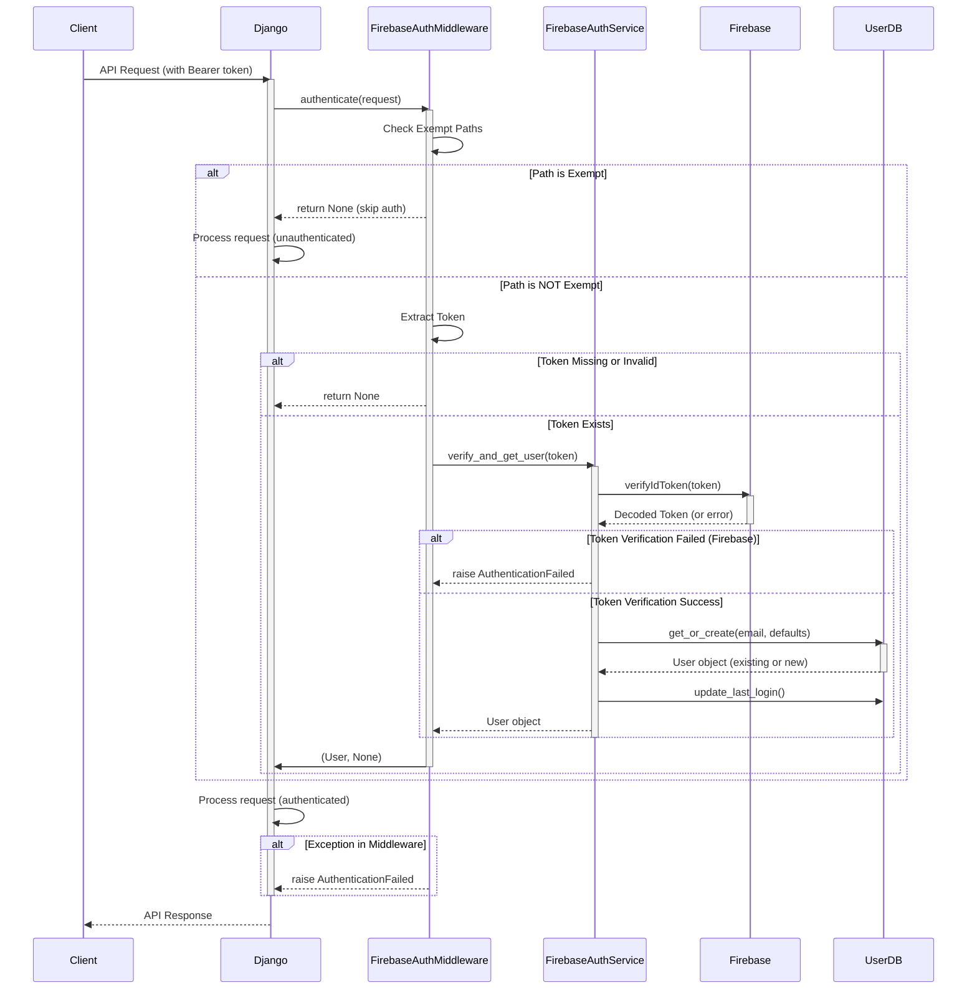
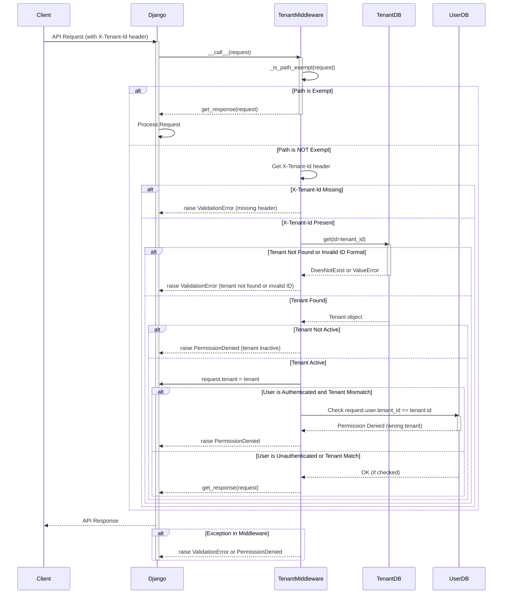
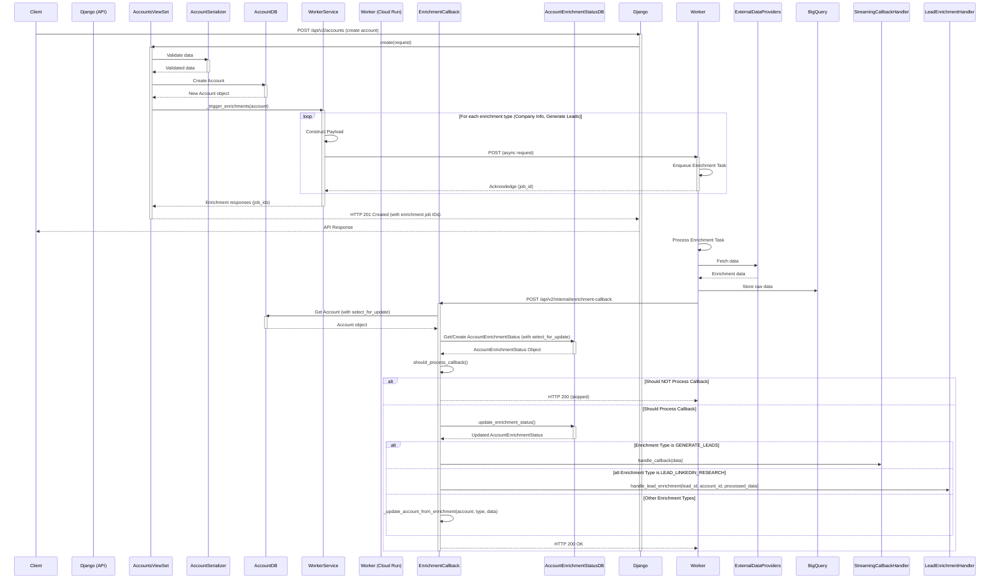
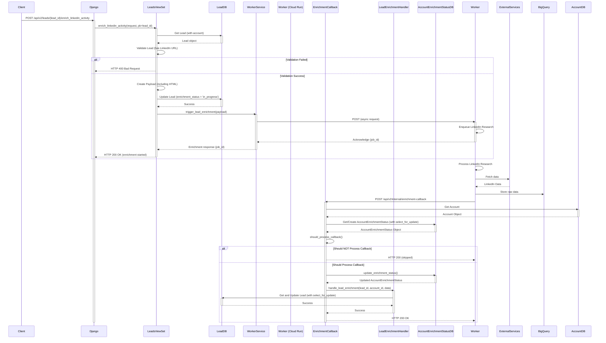

# Code Description of Userport Django app
*As generated by AI*

**1. Comprehensive Application Overview: Userport v2**

**1.1. Purpose and Goals**

Userport v2 is a B2B SaaS application designed to provide sales and marketing teams with tools for identifying, enriching, and managing potential customer accounts and leads. It aims to streamline the prospecting process by leveraging external data sources and AI-powered insights. The key goals include:

*   **Data Enrichment:** Augmenting basic account and lead information with data from external providers (e.g., LinkedIn, Clearbit, Apollo).
*   **Lead Generation:** Identifying potential leads based on defined Ideal Customer Profiles (ICPs) and product characteristics.
*   **Lead Scoring:** Prioritizing leads based on their fit and engagement.
*   **Multi-tenancy:** Supporting multiple independent customer organizations (tenants) within a single instance of the application.
*   **Scalability and Reliability:** Designed to handle a growing number of tenants, accounts, and leads, with robust asynchronous processing.
*   **Extensibility:** Allowing for the addition of new features, enrichment sources, and integrations.

**1.2. Core Technologies and Architecture**

*   **Backend Framework:** Django (5.1.4) + Django REST Framework (DRF) 3.15.1.  This choice provides a mature, well-documented, and secure foundation for building web applications and APIs. DRF simplifies `REST`ful API development.
*   **Database:**
    *   **Primary:** PostgreSQL. Chosen for its strong relational capabilities, data integrity features, and support for JSONB data types.
    *   **Data Warehouse:** Google BigQuery.  Used for storing large volumes of raw enrichment data, enabling historical analysis and reporting.
*   **Authentication and Authorization:**
    *   **Firebase Authentication:** Provides user authentication (login, registration, password management) and generates JWT (JSON Web Token) tokens for API security. This leverages a managed service, reducing development overhead and improving security.
    *   **Custom Django Authentication Backend:**  The `FirebaseAuthMiddleware` acts as a custom authentication backend within Django, bridging Firebase Authentication with Django's user model.
    *   **Role-Based Access Control (RBAC):** Implemented using custom permission classes (`IsTenantAdmin`, `IsInternalAdmin`, `IsInternalCS`, `HasRole`) that check user roles against allowed roles for specific API endpoints and objects.
*   **Asynchronous Task Processing:**
    *   **External Worker Service:**  A separate service (likely running on Google Cloud Run, based on the `WorkerService` and related configurations) handles long-running tasks such as data enrichment and lead generation. This prevents blocking the main API server.
    *   **Communication:** The Django application communicates with the worker service via HTTP requests, using OIDC (OpenID Connect) tokens for authentication.
    *   **Job Queue (Inferred):**  Although not explicitly detailed, the presence of a `WorkerService` and references to `job_id` strongly suggest the use of a job queue (e.g., Celery, Google Cloud Tasks, or a similar system) within the worker service to manage and distribute tasks.
*   **API Design:** `REST`ful API following common conventions. Uses DRF's ViewSets and serializers for efficient API development and data validation.
*   **Deployment:**
    *   **Containerization:** Docker.  Facilitates consistent deployments across different environments.
    *   **Orchestration:** Kubernetes (GKE - Google Kubernetes Engine).  Provides automated deployment, scaling, and management of containerized applications.
    *   **Cloud Provider:** Google Cloud Platform (GCP).  Leverages various GCP services:
        *   Cloud Run (for the worker service)
        *   Cloud SQL (for PostgreSQL)
        *   BigQuery (for data warehousing)
        *   Cloud Build (for CI/CD)
        *   Cloud Logging (for centralized logging)
        *   Workload Identity (for secure service-to-service authentication)
    * **Infrastructure as Code (IaC):** Deployment.yaml, backend-config.yaml, service.yaml are all examples of this.

**1.3. Design Patterns and Principles**

*   **Microservices (Partial):**  The separation of the main Django application and the worker service indicates a move towards a microservices architecture, although it's not fully implemented. This separation allows for independent scaling and development of different components.
*   **Model-View-ViewSet (MVVC):** Django's structure, combined with DRF's ViewSets, follows a variation of the Model-View-Controller (MVC) pattern, promoting separation of concerns.
*   **Repository Pattern (Implied):** The use of Django's ORM and managers (like `SoftDeleteManager`) can be considered a form of the repository pattern, abstracting data access logic.
*   **Service Layer (Emerging):** The `FirebaseAuthService` and `WorkerService` classes represent a service layer, encapsulating business logic and interactions with external systems.
*   **Dependency Injection (DI - Limited):**  While not explicitly using a DI framework, the structure of `WorkerService` (taking dependencies like `base_url` and `timeout` in the constructor) allows for easier testing and configuration.
*   **Observer Pattern (Implied):**  The interaction between the Django application and the worker service, particularly with the callback mechanism, hints at an observer pattern, where the worker service notifies the Django application upon completion of tasks.
*   **Single Responsibility Principle:**  Classes and modules generally have well-defined responsibilities (e.g., `FirebaseAuthMiddleware` handles only Firebase authentication).
*   **DRY (Don't Repeat Yourself):**  Base classes like `BaseMixin` and `TenantScopedViewSet` promote code reuse and consistency.
* **Idempotency**: The system strives to provide idempotency by storing and potentially resending the last, completed callback.

**2. Detailed Component Breakdown**

**2.1. Middleware**

*   **`TenantMiddleware`:**
    *   **Purpose:** Enforces multi-tenancy by validating the `X-Tenant-Id` header in each incoming request.
    *   **Mechanism:**
        1.  Checks if the request path is exempt from tenant verification (using `_is_path_exempt` and `_get_exempt_paths`).
        2.  Retrieves the `X-Tenant-Id` header.  Raises a `ValidationError` if missing.
        3.  Retrieves the corresponding `Tenant` object from the database.  Raises `ValidationError` if not found or `PermissionDenied` if inactive.
        4.  Adds the `Tenant` object to the `request` object (`request.tenant`).
        5.  If the user is authenticated, verifies that the user belongs to the retrieved tenant. Raises `PermissionDenied` if there's a mismatch.
    *   **Exempt Paths:**  Defines a list of paths (e.g., `/api/v2/health`, `/api/v2/auth`) that do not require tenant verification. This is important for publicly accessible endpoints.
    *   **Implications:**  This middleware is crucial for data isolation and security in a multi-tenant environment. It ensures that users can only access data belonging to their assigned tenant.
    * **Improvements:** Add cache for Tenant Objects.

*   **`FirebaseAuthMiddleware`:**
    *   **Purpose:** Authenticates API requests using Firebase Authentication tokens.
    *   **Mechanism:**
        1.  Checks if the request should skip Firebase authentication (based on the `_skip_firebase_auth` attribute or if the path is in `FIREBASE_AUTH_EXEMPT_PATHS`).
        2.  Extracts the `Authorization` header (expecting a "Bearer" token).  Returns `None` if missing or invalid format.
        3.  Calls `FirebaseAuthService.verify_and_get_user` to verify the token and retrieve/create the corresponding Django `User` object.
        4.  Updates the user's `last_login` timestamp.
        5.  Attaches the `User` object to the `request` object (`request.user`).
        6.  Returns an authentication header for failed authentication.
    *   **Implications:**  Provides a secure way to authenticate API requests, leveraging Firebase's robust authentication system.
    *  **Improvements:** Implement refresh token.

*   **`RequestLoggingMiddleware`:**
    *   **Purpose:** Logs detailed information about incoming requests, outgoing responses, and unhandled exceptions.
    *   **Mechanism:**
        *   **`process_request`:** Logs request method and path at the DEBUG level.
        *   **`process_response`:** Logs request method, path, and status code, using different log levels (INFO for 2xx, DEBUG for 3xx, WARNING for 4xx, ERROR for 5xx).
        *   **`process_exception`:** Logs unhandled exceptions at the CRITICAL level.
    *   **Implications:**  Provides valuable insights into API usage, performance, and errors, aiding in debugging and monitoring.  The different log levels allow for filtering and prioritizing log messages.
    *  **Improvements:** Add response time

**2.2. Models**

*   **`Common Base Models`**
    *  `SoftDeleteMixin`: Implements soft deletion using a `deleted_at` field and custom managers (`SoftDeleteManager`, `SoftDeleteQuerySet`). This allows for recovering deleted records if needed.
    *  `AuditMixin`: Adds `created_at`, `updated_at`, and `created_by` fields to track object creation and modification.
    *  `TenantScopeMixin`: Adds a `tenant` foreign key, enforcing tenant association for relevant models.
    *   `BaseMixin`: Combines `TenantScopeMixin`, `AuditMixin`, and `SoftDeleteMixin` to provide a common base for most models.

*   **`Tenant`:**
    *   **Fields:**
        *   `id` (UUID): Unique identifier.
        *   `name` (CharField): Tenant's name.
        *   `website` (URLField): Tenant's website.
        *   `status` (CharField): Tenant's status (active, inactive, suspended). Uses `TenantStatus` choices.
        *   `settings` (JSONField): Tenant-specific settings (key-value pairs).
        *   `created_at`, `updated_at`, `created_by`: Audit fields (from `AuditMixin`).
        *   `deleted_at`: Soft deletion field (from `SoftDeleteMixin`).
    *   **Indexes:**  Indexes on `status`, `website`, and `settings` (GIN index for JSONB) for efficient querying.
    * **Implications**:  The core model for multi-tenancy. All other tenant-scoped models are related to this model.

*   **`User`:**
    *   **Extends:** `AbstractBaseUser`, `PermissionsMixin`.  This provides Django's built-in user authentication features.
    *   **Fields:**
        *   `id` (UUID): Unique identifier.
        *   `firebase_id` (CharField):  Links the Django user to the corresponding Firebase user.
        *   `email` (EmailField): User's email (unique).
        *   `first_name`, `last_name` (CharField): User's name.
        *   `role` (CharField): User's role (user, tenant_admin, internal_cs, internal_admin).  Uses `UserRole` choices.
        *   `status` (CharField): User's status (active, inactive, suspended). Uses `UserStatus` choices.
        *   `last_login` (DateTimeField):  Timestamp of the user's last login.
        *   `is_staff` (BooleanField): Indicates if the user has access to the Django admin.
        *   `created_at`, `updated_at`, `created_by`: Audit fields.
        *   `deleted_at`: Soft deletion field.
        *   `tenant` (ForeignKey to `Tenant`):  The tenant the user belongs to.
    *   **`USERNAME_FIELD = 'email'`:**  Specifies that the email field is used for authentication.
    *   **`REQUIRED_FIELDS = []`:**  No additional fields are required for user creation via the command line.
    *   **`objects = AppUserManager()`:** Uses a custom user manager (`AppUserManager`).
    *   **`unique_together = [['tenant', 'email']]`:** Ensures that email addresses are unique within each tenant.
    *   **Implications:** This model combines Django's user authentication with Firebase Authentication and multi-tenancy. The custom user manager handles user creation and superuser creation.

*   **`Product`:**
    *   **Fields:**
        *   `id` (UUID)
        *   `name` (CharField)
        *   `description` (TextField)
        *   `icp_description` (TextField): Ideal Customer Profile.
        *   `persona_role_titles` (JSONField):  Stores information about target roles (likely a dictionary of roles and related data).
        *   `keywords` (ArrayField):  Keywords associated with the product.
        *   `settings` (JSONField)
        * `website` (URLField):  Product's website
        *   `created_at`, `updated_at`, `created_by`, `tenant`: Standard fields.
        *   `deleted_at`: Soft deletion.
        * `playbook_description`: text field for storing the playbooks for a given product.

    *   **`unique_together = [['tenant', 'name']]`:** Ensures that product names are unique within each tenant.
    *   **Implications:**  Represents a product or service offered by a tenant. The `persona_role_titles` and `icp_description` are crucial for targeting the right leads.

*   **`Account`:**
    *   **Fields:**
        *   `id` (UUID)
        *   `product` (ForeignKey to `Product`):  The product this account is associated with.
        *   `name` (CharField): Company name.
        *   `website` (URLField)
        *   `linkedin_url` (URLField)
        *   `industry` (CharField)
        *   `location` (CharField)
        *   `employee_count` (IntegerField)
        *   `company_type` (CharField)
        *   `founded_year` (IntegerField)
        *   `technologies` (JSONField):  The company's technology stack.
        * `customers`: List of customer names.
        * `competitors`: List of competitor names.
        *   `funding_details` (JSONField)
        *   `enrichment_sources` (JSONField): Tracks the status of enrichment from different sources.
        *   `last_enriched_at` (DateTimeField)
        *   `custom_fields` (JSONField):  Allows for storing dynamic, tenant-defined data.
        *   `settings` (JSONField)
        *   `created_at`, `updated_at`, `created_by`, `tenant`: Standard fields.
        *   `deleted_at`: Soft deletion.
    *   **`get_enrichment_summary()`:**  Calculates an overall enrichment status summary based on the related `AccountEnrichmentStatus` objects.
    *   **Implications:** Represents a target customer company.  The `enrichment_status` and related fields are key for tracking the progress of data enrichment.

*   **`Lead`:**
    *   **Fields:**
        *   `id` (UUID)
        *   `account` (ForeignKey to `Account`): The account this lead belongs to.
        *   `first_name`, `last_name` (CharField)
        *   `role_title` (CharField)
        *   `linkedin_url` (URLField)
        *   `email` (EmailField)
        *   `phone` (CharField)
        *   `enrichment_status` (CharField):  Uses `EnrichmentStatus` choices (pending, in_progress, completed, failed).
        *   `custom_fields` (JSONField)
        *   `score` (FloatField): A numerical score representing the lead's quality/fit.
        *   `last_enriched_at` (DateTimeField)
        *   `source` (CharField):  Uses `Lead.Source` choices (manual, enrichment, import).
        *   `suggestion_status` (CharField): Uses `Lead.SuggestionStatus` choices (suggested, approved, rejected, manual).
        *   `enrichment_data` (JSONField): Stores raw and processed enrichment data, including a Pydantic submodel for LinkedIn Research.
        *   `created_at`, `updated_at`, `created_by`, `tenant`: Standard fields.
        *   `deleted_at`: Soft deletion.
    *   **Implications:**  Represents a potential contact within a target account. The `score`, `enrichment_status`, `source`, and `suggestion_status` fields are important for lead management and prioritization.

* **`AccountEnrichmentStatus`**
    * Fields
      *   `id` (UUID)
      *   `account` (ForeignKey to `Account`)
      *   `enrichment_type` (CharField): Type of enrichment. Uses `EnrichmentType` choices.
      * `status` (CharField): Enrichment Status. Uses `EnrichmentStatus`
      * `completion_percent`: Percentage completion.
      *   `last_successful_run` (DateTimeField)
      *   `last_attempted_run` (DateTimeField)
      *   `next_scheduled_run` (DateTimeField)
      *   `failure_count` (IntegerField)
      *   `data_quality_score` (FloatField)
      *   `source` (CharField): Data source for enrichment (e.g., 'proxycurl', 'linkedin').
      *   `error_details` (JSONField):  Stores details of any errors encountered during enrichment.
      *   `metadata` (JSONField):  Stores additional metadata, such as pagination information.
        *   **`unique_together = ('account', 'enrichment_type')`:**  Ensures that there's only one status record per account and enrichment type.
        *   **Implications:** This model is crucial for tracking the progress and status of different enrichment processes for each account.  It allows for retries, scheduling, and monitoring. The addition of pagination information is very important for handling large datasets.

*   **`Config`:**
    *   **Fields:**
        *   `id` (UUID)
        *   `key` (CharField): Configuration key.
        *   `value` (JSONField): Configuration value (can be any JSON data).
        *   `scope` (CharField):  Uses `ConfigScope` choices (global, tenant, user).
        *   `description` (TextField)
        *   `tenant` (ForeignKey to `Tenant`, optional):  Required for tenant and user scopes.
        *   `user` (ForeignKey to `User`, optional): Required for user scope.
        *   `created_at`, `updated_at`, `created_by`: Audit fields (from `AuditMixin`).
        *   `deleted_at`: Soft deletion field.
    *   **`unique_together = [['scope', 'tenant', 'user', 'key']]`:**  Ensures that configuration keys are unique within their scope.
    *   **`clean()` method:**  Validates that the `tenant` and `user` fields are set correctly based on the `scope`.
    *   **Implications:**  Provides a flexible way to store system-wide configuration settings, feature flags, and limits. The different scopes allow for granular control over configuration.

*   **`Settings`:**
    *   **Fields:**
        *   `id` (UUID)
        *   `key` (CharField)
        *   `value` (JSONField)
        *   `user` (ForeignKey to `User`, optional):  If set, the setting is specific to this user.
        *   `tenant` (ForeignKey to `Tenant`):  Settings always belong to a tenant.
        *   `created_at`, `updated_at`, `created_by`: Audit fields.
        *   `deleted_at`: Soft deletion.
    *   **`unique_together = [['tenant', 'user', 'key']]`:** Ensures that setting keys are unique within their scope (tenant or user).
    *   **Implications:**  Allows for storing user preferences and tenant-specific settings, providing customization options.

**2.3. APIs (Django REST Framework)**

*   **Common Base Class:** `TenantScopedViewSet`
    *   **Purpose:** Provides common functionality for all API ViewSets, including tenant scoping, soft deletion, and exception handling.
    *   **`get_queryset()`:** Filters the queryset to include only objects belonging to the current user's tenant.  Uses the model's default manager, which automatically handles soft deletion.
    *   **`perform_create()`:**  Automatically sets the `tenant` and `created_by` fields when creating new objects.
    *   **`perform_destroy()`:** Implements soft deletion by calling the model's `delete()` method (which sets the `deleted_at` field).
    *   **`handle_exception()`:** Provides custom exception handling for `PermissionDenied` and `Http404` exceptions, returning standardized error responses.

* **Authentication APIs (`auth_urls.py`, `auth_apis.py`)**
    *  `hello_without_auth`: GET, POST. No authentication needed.
    *  `auth_hello_with_firebase`: GET, POST. Needs authentication.

*   **Health Check APIs (`health_urls.py`, `health_apis.py`)**
    *   `/health`:  Performs a comprehensive health check, including database connectivity and system resource usage (CPU, memory, disk).  Returns a 200 status if healthy, 503 if unhealthy.
    *   `/health/ready`:  Checks if the application is ready to serve traffic (primarily checks database connectivity). Returns 200 if ready, 503 if not.
    *   `/health/status`:  A simple liveness check that always returns 200 OK with a status of "alive".

*   **Tenant APIs (`tenant_urls.py`, `tenant_viewset.py`)**
    *   **`TenantViewSet`:**
        *   **Permissions:** `IsInternalAdmin` (with an exception for GET requests, which allow Tenant Admins to see their own tenant).
        *   **Actions:**
            *   `list` (GET):  Retrieves a list of tenants (filtered for tenant admins).
            *   `create` (POST):  Creates a new tenant (using the `TenantCreateSerializer`).  Also creates a Firebase user and a corresponding Django user with the tenant admin role.
            *   `retrieve` (GET):  Retrieves a specific tenant.
            *   `update` (PUT), `partial_update` (PATCH):  Updates a tenant.
            *   `destroy` (DELETE):  Deletes a tenant (soft delete).
            *   `invite_user` (POST): Invites a user to a tenant.  Creates a Firebase user if one doesn't exist and creates/updates the corresponding Django user.  Sends an invitation email (implementation not shown).
    *   **`TenantUserViewSet`:**
        *   **Permissions:** `HasRole(allowed_roles=[UserRole.TENANT_ADMIN.value, UserRole.INTERNAL_ADMIN.value])`
        *   **Actions:**
            *   `list` (GET): Retrieves a list of users within the current user's tenant.
            *   `retrieve` (GET):  Retrieves a specific user.
            *   `update` (PUT), `partial_update` (PATCH):  Updates a user.
            *   `destroy` (DELETE): Deletes a user (soft delete).
            *   `update_role` (PATCH): Updates a user's role within the tenant.

*   **Product APIs (`products/__init__.py`, `products_viewset.py`)**
    *   **`ProductViewSet`:**
        *   **Permissions:** `HasRole(allowed_roles=[UserRole.TENANT_ADMIN.value, UserRole.INTERNAL_ADMIN.value])`
        *   **Actions:** Standard CRUD operations (list, create, retrieve, update, destroy).
        *   **Filtering:** Supports filtering by `id`, `website`, and `created_by`.
        * **Ordering**: Supports ordering.

*   **Account APIs (`accounts/__init__.py`, `accounts_viewset.py`)**
    *   **`AccountsViewSet`:**
        *   **Permissions:** `HasRole(allowed_roles=[UserRole.USER, UserRole.TENANT_ADMIN, UserRole.INTERNAL_ADMIN, UserRole.INTERNAL_CS])`
        *   **Actions:**
            *   `list`, `create`, `retrieve`, `update`, `partial_update`, `destroy`: Standard CRUD operations.
            *   `bulk_create` (POST):  Creates multiple accounts in bulk.  Triggers enrichment jobs (company info and lead generation) for the newly created accounts.
        *   **Filtering:**  Supports filtering by `id`, `website`, `linkedin_url`, and `created_by`.
        * **Ordering**: Ordering supported.
        *   **`_trigger_enrichments()`:**  A helper method to trigger enrichment jobs via the `WorkerService`.

*   **Lead APIs (`leads/__init__.py`, `leads_viewset.py`)**
    *   **`LeadsViewSet`:**
        *   **Permissions:** `HasRole(allowed_roles=[UserRole.USER, UserRole.TENANT_ADMIN, UserRole.INTERNAL_ADMIN, UserRole.INTERNAL_CS])`
        *   **Actions:**
            *   `list`, `create`, `retrieve`, `update`, `partial_update`, `destroy`: Standard CRUD operations.
            *   `generate` (POST):  Triggers lead generation for a specific account (using the `LeadGenerationMixin`).
            *   `bulk_create` (POST):  Creates multiple leads in bulk.
            *   `enrich_linkedin_activity` (POST):  Triggers LinkedIn research enrichment for a specific lead.  Sends HTML content (posts, comments, reactions) to the worker service.
        *   **Filtering:** Supports filtering by `id`, `account`, `email`, `phone`, `created_by`, and `suggestion_status`.
        *  **Ordering:** Supports ordering, defaults to `-score`.

*   **Config and Settings APIs (`config/config_apis.py`, `config/urls.py`)**
    *   **`ConfigViewSet`:**
        *   **Permissions:** `IsInternalAdmin`
        *   **Actions:**  Standard CRUD operations for managing system-wide configurations.
    *   **`SettingsViewSet`:**
        *   **Permissions:** `TenantScopedViewSet` (base class providing authentication). Access controlled based on user role within `get_queryset`, `perform_create`, `perform_update`, and `perform_destroy`.
        *   **Actions:**
            *   Standard CRUD operations.
            *   `bulk_update` (POST):  Allows for updating multiple settings in a single request.
        *   **Access Control:**
            *   Internal admins can access all settings.
            *   Tenant admins can access tenant-level settings.
            *   Regular users can access their own settings and tenant settings.
    * **`get_merged_context` (GET /api/v2/context/):**
        * Returns merged config and settings.
        * User settings > Tenant Settings.
        * User configs > Tenant configs > Global configs

* **Enrichment Callback API (`common/enrichment_callback.py`)**

    *   **`enrichment_callback` (POST /api/v2/internal/enrichment-callback/):**
        *   **Authentication:**  Uses `@verify_cloud_run_token` (currently commented out). This decorator is intended to verify OIDC tokens from Cloud Run.
        *   **Purpose:**  Handles callbacks from external enrichment services.
        *   **Mechanism:**
            1.  Validates request data (requires `account_id`, `status`, `enrichment_type`).
            2.  Retrieves the `Account` object (using `select_for_update` to prevent race conditions).
            3.  Checks the current `AccountEnrichmentStatus` (using `get_current_enrichment_status` and `should_process_callback`) to determine if the callback should be processed (handles idempotency and pagination).
            4.  Atomically updates the `AccountEnrichmentStatus` (using `update_enrichment_status`).
            5.  Processes the callback data based on the `enrichment_type`:
                *   `GENERATE_LEADS`:  Uses `StreamingCallbackHandler` to handle paginated lead data.
                *   `LEAD_LINKEDIN_RESEARCH`: Uses `LeadEnrichmentHandler` to process individual lead enrichment data.
                *   Other types:  Calls `_update_account_from_enrichment` to update account fields (currently handles `COMPANY_INFO` and another version of `GENERATE_LEADS`).
            6.  Returns a success response with an enrichment summary.

    *   **`StreamingCallbackHandler`:**
        *   **`handle_callback`:**
            *   Handles pagination logic.  If the callback contains pagination data and the current page is less than the total pages, it processes the leads for the current page and returns `None` (indicating that the process is not yet complete).
            *   If it's the final page, it processes the leads, updates the account status, and returns the full data.
            *   Uses `_process_leads_batch` and `_update_account_final_status`.
        *   **`_process_leads_batch`:**  Processes a batch of leads from the callback data.  Creates or updates `Lead` objects in the database.
        *   **`_create_or_update_lead`:**  Creates or updates a single `Lead` object based on the provided data.
        *   **`_update_account_final_status`:** Updates the `AccountEnrichmentStatus` to "completed" after all leads have been processed.

    *   **`LeadEnrichmentHandler`:**
        *   **`handle_lead_enrichment`:**  Processes enrichment data for a single lead (specifically from LinkedIn research).  Updates the `Lead` object with the provided data, including LinkedIn activity and personality insights.

**2.4. Services**

*   **`FirebaseAuthService`:**
    *   **`__init__`:** Initializes the Firebase Admin SDK. Tries to get existing app, and initializes new if needed. Supports initialization via service account file or Application Default Credentials.
    *   **`verify_and_get_user(id_token)`:**
        1.  Verifies a Firebase ID token.
        2.  Retrieves the user's email from the decoded token.
        3.  Gets or creates a corresponding Django `User` object.
        4.  Returns the Django `User` object.
    *   **Implications:**  Provides a clean interface for interacting with Firebase Authentication.

*   **`WorkerService`:**
    *   **`__init__`:**
        *   Sets the base URL for the worker service API.
        *   Sets a default timeout.
        *   Determines the audience URL for OIDC token verification (different for local development and Cloud Run).
        *   Initializes Google Cloud credentials (either using a local service account file or Workload Identity).
    *   **`_get_id_token()`:**  Retrieves a fresh OIDC ID token for authenticating with the worker service.
    *   **`trigger_lead_generation(payload)`:**  Sends a request to the worker service to start lead generation for a specific account.
    *   **`trigger_account_enrichment(accounts)`:**  Sends a request to the worker service to start account enrichment for a list of accounts.
    *   **`trigger_lead_enrichment(payload)`:**  Sends a request to the worker service to start lead enrichment (LinkedIn research) for a specific lead.
    * **Implications:** This service acts as a client for the worker service, abstracting the communication details and authentication.

**2.5. Data Models (Pydantic)**

* Located in `app/models/enrichment/lead_linkedin_research.py`.
* **Purpose**: Define the structure of data used in LinkedIn Enrichment and to send to the worker.
* Includes models for:
    * `LinkedInResearchInputData`: Input for the LinkedIn Research.
    *  `LinkedInActivity`: Data structure for a LinkedIn activity.
    *  `LinkedInProfile`:  Minimal lead info
    * `PersonalityTraits`: Personality traits of a lead.
    *  `RecommendedApproach`: Recommended approach for a lead.
    *  `PersonalizationSignal`: Personalized signal data.
    *  `AreaOfInterest`: Areas of interest.
    *  `EnrichmentMetadata`: Metadata.
    *  `PersonalityInsights`: Stores insights from LinkedIn data.
    *  `LinkedInEnrichmentData`:  Represents the overall structure of LinkedIn enrichment data.

**2.6.  Utils**

* **`retry_utils.py`**: Implements a `with_retry` decorator for retrying asynchronous operations with exponential backoff.
    *   **`RetryConfig`:**  A class to configure retry behavior (max attempts, base delay, max delay, exponential base, retryable exceptions).
    *   **`RetryableError`:**  A base exception class for errors that should be retried.
    *  **`RETRYABLE_STATUS_CODES`**: List of HTTP Status Codes that will trigger a retry.
* **`permission_logging.py`**:
    * **`log_permission_check`:** Decorator to log all permission checks, including successes and failures.
    * **`PermissionLoggingMixin`:** Mixin to easily add logging to permission classes.

**3. Sequence diagrams**

**1. FirebaseAuthMiddleware Sequence Diagram**

This diagram shows how `FirebaseAuthMiddleware` authenticates a request:

**Key Points:**

*   **Exempt Paths:**  The middleware first checks if the requested path is exempt from Firebase authentication.  If so, it skips the authentication process.
*   **Token Extraction:** It extracts the Bearer token from the `Authorization` header.
*   **Firebase Verification:**  `FirebaseAuthService` interacts with Firebase to verify the token.
*   **User Retrieval/Creation:**  `FirebaseAuthService` gets or creates a Django `User` object corresponding to the Firebase user.
*   **Authentication Result:** The middleware returns a tuple `(user, None)` on successful authentication, or `None` if authentication is skipped or fails (before token verification).  It raises `AuthenticationFailed` if the token is invalid.

**2. TenantMiddleware Sequence Diagram**

This diagram shows how `TenantMiddleware` handles tenant validation:

**Key Points:**

*   **Exempt Paths:** Checks if the path is exempt from tenant verification.
*   **Header Check:**  Retrieves the `X-Tenant-Id` header.
*   **Tenant Retrieval:**  Gets the `Tenant` object from the database.
*   **Status Check:** Verifies that the tenant is active.
*   **User-Tenant Association:** If the user is authenticated, ensures the user belongs to the specified tenant.
* **Request Modification:** Sets `request.tenant`.

**3. Account Creation and Enrichment Sequence Diagram**

This diagram illustrates the full flow of creating an account and triggering enrichment:

**Key Points:**

*   **API Request:** The client sends a request to create an account.
*   **ViewSet Handling:** The `AccountsViewSet` validates the data, creates the `Account` object, and then calls `_trigger_enrichments`.
*   **Asynchronous Trigger:** `_trigger_enrichments` uses the `WorkerService` to send asynchronous requests to the worker service.  Crucially, the Django API *does not wait* for these tasks to complete.
*   **Worker Processing (Simplified):** The worker service (running separately) processes the enrichment tasks.
*   **Callback:** The worker service sends a callback to `enrichment_callback` when an enrichment task (or a page of a task) is finished.
*   **Idempotency and Pagination:** `enrichment_callback` uses `should_process_callback` to determine if it should actually process the callback, handling pagination and avoiding duplicate processing.
*   **Status Updates:** `update_enrichment_status` atomically updates the `AccountEnrichmentStatus`.
* **Streaming/Handlers:** The appropriate handler is called based on `enrichment_type`.

**4. Lead LinkedIn Research Sequence Diagram**

This focuses on the specific flow of enriching a lead's LinkedIn activity:

**Key Points:**

*   **Lead Retrieval:** The `LeadsViewSet` retrieves the `Lead` object.
*   **Payload Creation:** It constructs a payload, including HTML content from the request, and other input data by using Pydantic Models.
*   **Status Update:**  The lead's `enrichment_status` is updated to "in_progress" *before* sending the request to the worker.
*   **Asynchronous Trigger:** The `WorkerService` is used to send an asynchronous request.
*   **Callback Handling:** The `enrichment_callback` is used, just like in account enrichment. This is important for consistency and handling potential retries.
*   **`LeadEnrichmentHandler`:** This handler is specifically responsible for processing the LinkedIn research data and updating the `Lead` object.
* **Pydantic Usage**: The request data is constructed into a Pydantic model and serialized to send to worker service. The response is parsed into Pydantic Models and the data is updated.

**3. Deployment and Infrastructure**

*   **Dockerfile:**  Defines the Docker image for the Django application.
    *   Uses a multi-stage build to reduce image size.
    *   Installs system dependencies (including `cloud-sql-proxy`).
    *   Installs Python dependencies from `requirements.txt`.
    *   Copies the application code.
    *   Sets environment variables.
    *   Runs `collectstatic` (though this is currently commented out).
    *   Starts Gunicorn as the web server.
*   **Kubernetes Configuration (`k8s` directory):**
    *   **`deployment.yaml`:** Defines the Kubernetes Deployment for the Django application.
        *   Specifies the Docker image, number of replicas, resource requests and limits, environment variables, readiness and liveness probes.
        *   Uses a `serviceAccountName` (`userport-ksa`), indicating Workload Identity is used.
        *   Mounts secrets (database credentials).
    *   **`backend-config.yaml`:**  Defines a BackendConfig for the Google Cloud Load Balancer, configuring health checks.
    *   **`service.yaml`:**  Defines a Kubernetes Service (type `NodePort`) to expose the Django application.  Includes an annotation for the `BackendConfig`.
*   **Cloud Build Configuration (`cloudbuild.yaml`):**
    *   Defines a Cloud Build pipeline for building and deploying the application.
    *   **Steps:**
        1.  **Build:** Builds the Docker image using BuildKit, with caching.
        2.  **Push (latest):** Pushes the image to Google Container Registry (GCR) with the `latest` tag.
        3.  **Push (SHA):** Pushes the image to GCR with a tag based on the commit SHA.
        4.  **Get Credentials:** Retrieves Kubernetes cluster credentials.
        5.  **Setup KSA:** Annotates the Kubernetes Service Account for Workload Identity.
        6.  **Create Secrets:** Creates a Kubernetes Secret for database credentials.
        7.  **GKE Deploy:** Deploys the application to Google Kubernetes Engine (GKE) using the built image.
*   **Start Script (`start.sh`):**
    *   Detects if a service account file (`/secrets/service-account.json`) is present.  This determines whether to use local credentials (for development) or Workload Identity (for production).
    *   Starts the `cloud-sql-proxy` in the background, connecting to the Cloud SQL instance. The proxy provides secure access to the PostgreSQL database.
    *   Waits for the `cloud-sql-proxy` to become ready by repeatedly checking for a connection on port 5432 (up to 30 attempts with 2-second delays).
    *   Calculates the number of Gunicorn workers if `GUNICORN_WORKERS` is not set (using `2 * $(nproc) + 1`).
    *   Starts Gunicorn, binding to `0.0.0.0` on the specified port (defaulting to 8000), with the configured timeout and number of workers.  Uses the `userport.wsgi:application` module.
    * `exec` replaces the shell process with the gunicorn process.

**4. Detailed Workflow Examples**

**4.1. Account Creation and Enrichment**

1.  **User Action:** A user (with appropriate permissions) creates a new account via the `/api/v2/accounts` endpoint, providing the company name, website, and associated product ID.
2.  **API Handling:**
    *   The `TenantMiddleware` verifies the `X-Tenant-Id` header.
    *   The `FirebaseAuthMiddleware` verifies the user's Firebase token.
    *   The `AccountsViewSet.create` method handles the request:
        *   Validates the input data using the `AccountDetailsSerializer`.
        *   Creates a new `Account` object in the database.
        *   Calls `_trigger_enrichments` to initiate asynchronous enrichment tasks.
3.  **Enrichment Trigger:**
    *   `_trigger_enrichments` calls the `WorkerService` to send requests to the external worker service.  Separate requests are sent for company information enrichment and lead generation.
    *   The `WorkerService` constructs the request payload, including the account ID, website, product details, and tenant ID.  It also adds an OIDC token to the request header for authentication.
    *   The worker service (running on Cloud Run) receives the request, authenticates it (using OIDC), and enqueues the enrichment tasks.
4.  **Asynchronous Processing (Worker Service - Inferred):**
    *   The worker service (likely using a job queue like Celery or Google Cloud Tasks) processes the enrichment tasks.
    *   It interacts with external data providers (e.g., LinkedIn, Clearbit, Apollo) to retrieve company information and potential leads.
    *   It stores the raw enrichment data in BigQuery.
    * It sends intermediate updates to the `enrichment_callback` endpoint, if needed.
5.  **Enrichment Callback:**
    *   When an enrichment task is complete (or a page of results is ready), the worker service sends a callback to the `/api/v2/internal/enrichment-callback` endpoint.  This includes the `job_id`, `account_id`, `status`, `enrichment_type`, and `processed_data`.
    *   The `enrichment_callback` function:
        *   Verifies the Cloud Run token (though this is currently commented out – **CRITICAL: this should be enabled**).
        *   Retrieves the `Account` object.
        *   Gets/Creates or updates the `AccountEnrichmentStatus` record, tracking the progress and status of the enrichment.
        *   Processes the `processed_data` based on the `enrichment_type`.  For `GENERATE_LEADS`, this involves creating or updating `Lead` objects.  For `COMPANY_INFO`, this involves updating the `Account` object with the enriched data.
6.  **Result:** The account is populated with enriched data, and leads are generated (if requested).  The user can view the updated information through the API.

**4.2. Lead LinkedIn Research**

1.  **User Action:** A user triggers LinkedIn research enrichment for a specific lead via the `/api/v2/leads/{lead_id}/enrich_linkedin_activity` endpoint, providing the lead ID, and optionally HTML content (posts, comments, reactions).
2.  **API Handling:**
    *   The middleware components (tenant and authentication) perform their checks.
    *   The `LeadsViewSet.enrich_linkedin_activity` method handles the request:
        *   Retrieves the `Lead` object (and its related `Account` and `Product`).
        *   Validates that the lead has a LinkedIn URL.
        *   Constructs input data using Pydantic models `LinkedInResearchInputData`.
        *   Creates a payload for the worker service, including the lead ID, account ID, person's name, company name, LinkedIn URL, HTML content, job ID, user ID, and other input data.
        *   Updates the `Lead` object's `enrichment_status` to "in_progress".
        *   Calls the `WorkerService.trigger_lead_enrichment` method to send the request to the worker service.
3.  **Asynchronous Processing (Worker Service - Inferred):**
    *   The worker service receives the request, authenticates it, and enqueues the enrichment task.
    *   It likely uses a library or service that can process LinkedIn data (and potentially other sources, based on the `research_request_type` field).
    *   It stores the raw enrichment data in BigQuery.
4.  **Enrichment Callback:**
    *   When the LinkedIn research is complete, the worker service sends a callback to the `/api/v2/internal/enrichment-callback` endpoint.
    *   The `enrichment_callback` function:
        *   Verifies the token (again, this needs to be uncommented).
        *   Retrieves the `Account` object.
        *   Updates the `AccountEnrichmentStatus`.
        *   Calls `LeadEnrichmentHandler.handle_lead_enrichment` to process the data.
        *    This method uses Pydantic Models to parse the LinkedIn research data, extracts the personality insights, merges them with `lead.enrichment_data` and `lead.custom_fields`, and updates lead's `enrichment_status` to `COMPLETED`.
5.  **Result:** The `Lead` object is updated with LinkedIn activity data, personality insights, and other enriched information.

**6. Key Dependencies and Versions:**

*   Django (5.1.4)
*   djangorestframework (3.15.1)
*   djangorestframework-simplejwt (5.3.1)
*   firebase-admin (6.6.0)
*   google-cloud-logging (3.11.3)
*   psycopg2-binary (2.9.10)
*   gunicorn (2.0.27)
*   pydantic(2.10.5)
