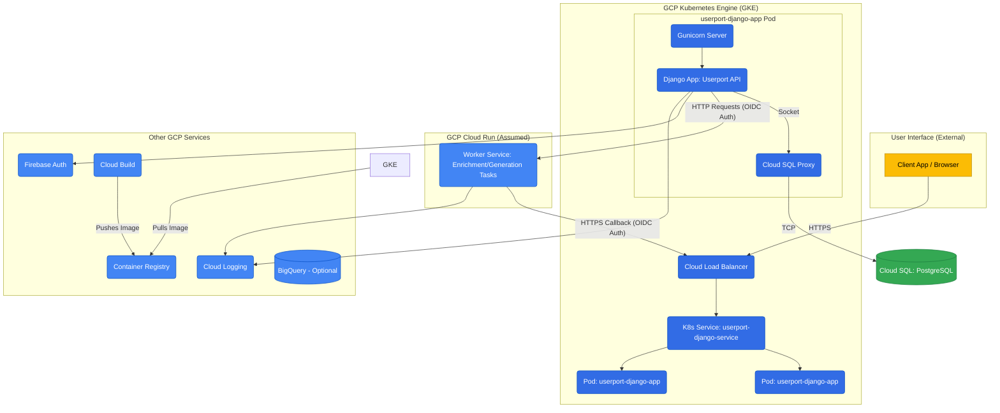
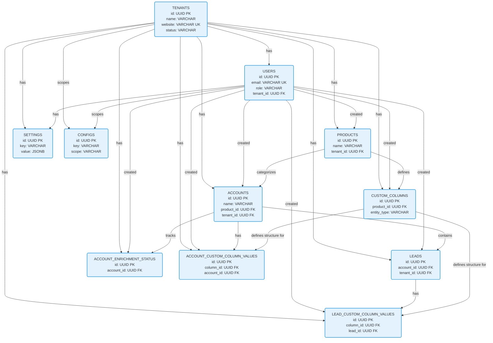

# Userport Django App - Comprehensive Codebase Documentation

**Version:** Based on code provided up to March 26, 2025.

## 1. Overview

**1.1. Purpose & Goals**

Userport v2 is a B2B SaaS application designed to provide sales and marketing teams with tools for identifying, enriching, and managing potential customer accounts and leads. It aims to streamline the prospecting process by leveraging external data sources and AI-powered insights. The key goals include:
* **Centralizing Data:** Managing customer `Tenants`, `Products`, `Accounts` (target companies), and `Leads` (contacts).
* **Data Enrichment:** Automatically augmenting `Account` and `Lead` data using external sources via an asynchronous `Worker` service. This includes company info, lead details, and LinkedIn activity/insights.
* **Lead Generation:** Identifying potential `Leads` for specific `Accounts` based on product definitions and ICPs, processed by the `Worker`.
* **AI-Powered Insights:** Allowing users to define `Custom Columns` (questions) answered by AI based on entity data, processed by the `Worker`.
* **Configuration & Settings:** Providing both system-level (`Config`) and user/tenant-level (`Settings`) customization.
* **Security & Isolation:** Ensuring strict data isolation between `Tenants` and controlling access based on `UserRoles`.

**1.2. Core Technologies**

* **Backend:** Django 5.1.4, Django REST Framework (DRF) 3.15.1
* **Database:** PostgreSQL (via Cloud SQL Proxy in GKE)
* **Authentication:** Firebase Authentication (JWT), DRF Simple JWT 5.3.1
* **Asynchronous Processing:** External Python service (referred to as "Worker", likely on Cloud Run) communicated via HTTP requests (`requests` library) authenticated with OIDC tokens.
* **Data Validation/Serialization:** DRF Serializers, Pydantic 2.10.5 (for enrichment data structures)
* **Web Server:** Gunicorn 2.0.27
* **Deployment:** Docker, Kubernetes (GKE), Google Cloud Build, Cloud SQL Proxy, Workload Identity
* **Logging:** Google Cloud Logging (`google-cloud-logging` 3.11.3)
* **Other Key Libraries:** `django-cors-headers`, `django-filter`, `psycopg2-binary`, `python-dotenv`

**1.3. High-Level Architecture**

The system consists of a core Django API service deployed on GKE and an external Worker service (likely Cloud Run) for handling asynchronous tasks.



**Key Interactions:**

1.  **User Request:** Client sends API request to the Load Balancer.
2.  **API Processing:** Request reaches a GKE pod, handled by Gunicorn/Django.
    * `RequestLoggingMiddleware` logs the request.
    * `TenantMiddleware` validates `X-Tenant-Id` and sets `request.tenant`.
    * `FirebaseAuthMiddleware` validates `Authorization: Bearer <Firebase Token>` and sets `request.user`.
    * DRF ViewSet handles the request, interacting with models.
    * Database access goes via the Cloud SQL Proxy sidecar.
3.  **Asynchronous Tasks:** For enrichment/generation:
    * Django App uses `WorkerService` to prepare payload.
    * `WorkerService` gets an OIDC token (using Workload Identity).
    * `WorkerService` sends an HTTP POST request to the Worker Service URL with the token.
    * Worker Service enqueues and processes the task.
4.  **Callback:** Worker Service sends an HTTP POST back to the Django App's `/internal/enrichment-callback/` endpoint, authenticated via OIDC token verified by `@verify_cloud_run_token`.
5.  **Callback Handling:** The Django App processes the callback, updates status tables (`AccountEnrichmentStatus`, `CustomColumnValue`), and updates primary models (`Account`, `Lead`).

## 2. Detailed Component Breakdown

**2.1. Middleware (`app/middleware/`)**

* **`TenantMiddleware`:**
    * **Purpose:** Ensures requests operate within the context of a single, valid tenant. Crucial for data isolation.
    * **Logic:**
        * Checks `_is_path_exempt` using `_get_exempt_paths` (e.g., health checks, auth endpoints).
        * Requires `X-Tenant-Id` header, raising `ValidationError` if absent.
        * Fetches `Tenant` by ID, raising `ValidationError` if not found or `PermissionDenied` if status is not 'active'.
        * Attaches the valid `Tenant` object to `request.tenant`.
        * If `request.user` exists, verifies `request.user.tenant_id == request.tenant.id`, raising `PermissionDenied` on mismatch.
* **`FirebaseAuthMiddleware` (DRF Authentication Backend):**
    * **Purpose:** Authenticates API requests using Firebase JWT tokens.
    * **Logic:**
        * Checks for `_skip_firebase_auth` attribute or `FIREBASE_AUTH_EXEMPT_PATHS` setting to bypass authentication.
        * Expects `Authorization: Bearer <token>` header. Returns `None` (unauthenticated) if missing or malformed.
        * Instantiates `FirebaseAuthService` and calls `verify_and_get_user(token)`.
        * If successful, updates `user.last_login` and returns `(user, None)` which sets `request.user`.
        * Propagates `AuthenticationFailed` exceptions from the service or raises its own on errors.
    * **`authenticate_header`:** Returns `'Bearer'` for WWW-Authenticate header on 401 responses.
* **`RequestLoggingMiddleware`:**
    * **Purpose:** Provides detailed request/response/exception logging to Google Cloud Logging.
    * **Logic:**
        * `process_request`: Records start time on `request.start_time`, logs basic request info (DEBUG).
        * `process_response`: Calculates duration, logs detailed info (method, path, status, duration in ms) with severity based on status code (2xx: INFO, 3xx: DEBUG, 4xx: WARNING, 5xx: ERROR).
        * `process_exception`: Logs unhandled exceptions with duration (CRITICAL).

**2.2. Models (`app/models/`) & Database Schema**

*(Derived from model definitions and latest migrations)*

**Common Fields (from `BaseMixin`):**
* `id` (UUID, PK)
* `tenant` (ForeignKey to `tenants`, Nullable) - *Note: Migrations altered this to be nullable, check if required on all inheriting models.*
* `created_at` (TimestampTZ, Not Null, Indexed)
* `updated_at` (TimestampTZ, Not Null)
* `created_by` (ForeignKey to `users`, Nullable, SET NULL)
* `deleted_at` (TimestampTZ, Nullable)

**Table: `tenants` (`app.models.Tenant`)**

| Column     | Type         | Constraints                               | Description              |
| :--------- | :----------- | :---------------------------------------- | :----------------------- |
| id         | UUID         | PK                                        | Primary Key              |
| name       | VARCHAR(255) | Not Null                                  | Tenant Name              |
| website    | VARCHAR(255) | Not Null, Unique                          | Tenant Website/Domain    |
| status     | VARCHAR(20)  | Not Null, Default: 'active'               | active/inactive/suspended |
| settings   | JSONB        | Nullable                                  | Tenant-specific settings |
| created_at | TIMESTAMPTZ  | Not Null, Indexed                         | Audit field              |
| updated_at | TIMESTAMPTZ  | Not Null                                  | Audit field              |
| created_by | UUID         | Nullable, FK -> users(id) ON DELETE SET NULL | Audit field              |
| deleted_at | TIMESTAMPTZ  | Nullable                                  | Soft delete field        |
*Indexes: `status`, `website`, GIN(`settings`)*

**Table: `users` (`app.models.User`)**

| Column         | Type         | Constraints                               | Description                           |
| :------------- | :----------- | :---------------------------------------- | :------------------------------------ |
| id             | UUID         | PK                                        | Primary Key                           |
| password       | VARCHAR(128) | Not Null                                  | Django password hash (unused?)        |
| last_login     | TIMESTAMPTZ  | Nullable                                  | Last login time                       |
| is_superuser   | BOOLEAN      | Not Null, Default: false                  | Django superuser flag                 |
| firebase_id    | VARCHAR(128) | Nullable, Unique, Indexed                 | Firebase UID                          |
| email          | VARCHAR(255) | Not Null, Unique (within non-deleted)     | User Email (Login ID)                 |
| first_name     | VARCHAR(100) | Nullable                                  | First Name                            |
| last_name      | VARCHAR(100) | Nullable                                  | Last Name                             |
| role           | VARCHAR(20)  | Not Null, Default: 'user', Indexed      | User Role (user, tenant_admin, etc.)  |
| status         | VARCHAR(20)  | Not Null, Default: 'active', Indexed    | User Status (active, inactive, etc.)  |
| is_staff       | BOOLEAN      | Not Null, Default: false                  | Django admin access                   |
| tenant_id      | UUID         | Nullable, FK -> tenants(id), Indexed    | User's Tenant                         |
| created_at     | TIMESTAMPTZ  | Not Null, Indexed                         | Audit field                           |
| updated_at     | TIMESTAMPTZ  | Not Null                                  | Audit field                           |
| created_by_id  | UUID         | Nullable, FK -> users(id) ON DELETE SET NULL | Audit field                           |
| deleted_at     | TIMESTAMPTZ  | Nullable                                  | Soft delete field                     |
*Unique Constraints: `(tenant_id, email)` where `deleted_at` is NULL*
*Other Indexes: `firebase_id`, `status`, `email`, `role`*

**Table: `products` (`app.models.Product`)**

| Column                 | Type         | Constraints                                   | Description                      |
| :--------------------- | :----------- | :-------------------------------------------- | :------------------------------- |
| id                     | UUID         | PK                                            | Primary Key                      |
| name                   | VARCHAR(255) | Not Null, Indexed                             | Product Name                     |
| description            | TEXT         | Not Null                                      | Product Description              |
| icp_description        | TEXT         | Nullable                                      | Ideal Customer Profile           |
| website                | VARCHAR(200) | Nullable                                      | Product Website URL              |
| persona_role_titles    | JSONB        | Not Null                                      | Target roles/personas            |
| keywords               | TEXT[]       | Nullable                                      | Associated keywords              |
| settings               | JSONB        | Nullable                                      | Product-specific settings        |
| playbook_description   | TEXT         | Nullable                                      | Sales playbook info              |
| tenant_id              | UUID         | Nullable, FK -> tenants(id), Indexed        | Owning Tenant                    |
| created_at             | TIMESTAMPTZ  | Not Null, Indexed                             | Audit field                      |
| updated_at             | TIMESTAMPTZ  | Not Null                                      | Audit field                      |
| created_by_id          | UUID         | Nullable, FK -> users(id) ON DELETE SET NULL, Indexed | Audit field                      |
| deleted_at             | TIMESTAMPTZ  | Nullable                                      | Soft delete field                |
*Constraints: `unique_active_product_name_per_tenant` (on `tenant_id`, `name` where `deleted_at` is NULL)*
*Other Indexes: `tenant_id`, `name`, `created_by_id`*

**Table: `accounts` (`app.models.Account`)**

| Column                    | Type         | Constraints                                   | Description                  |
| :------------------------ | :----------- | :-------------------------------------------- | :--------------------------- |
| id                        | UUID         | PK                                            | Primary Key                  |
| name                      | VARCHAR(255) | Not Null, Indexed                             | Company Name                 |
| website                   | VARCHAR(512) | Nullable, Indexed                             | Company Website              |
| linkedin_url              | VARCHAR(512) | Nullable                                      | LinkedIn Company URL         |
| industry                  | VARCHAR(255) | Nullable                                      | Industry                     |
| location                  | VARCHAR(255) | Nullable                                      | Location string              |
| employee_count            | INTEGER      | Nullable                                      | Number of employees          |
| company_type              | VARCHAR(100) | Nullable                                      | Type of company              |
| founded_year              | INTEGER      | Nullable                                      | Year founded                 |
| customers                 | TEXT[]       | Nullable                                      | List of customer names       |
| competitors               | TEXT[]       | Nullable                                      | List of competitor names     |
| technologies              | JSONB        | Nullable                                      | Tech stack summary           |
| full_technology_profile | JSONB        | Nullable                                      | Detailed tech profile        |
| funding_details           | JSONB        | Nullable                                      | Funding info                 |
| enrichment_sources        | JSONB        | Nullable                                      | Status/data per source       |
| last_enriched_at          | TIMESTAMPTZ  | Nullable                                      | Last enrichment timestamp    |
| custom_fields             | JSONB        | Nullable                                      | Dynamic custom fields        |
| settings                  | JSONB        | Nullable                                      | Account-specific settings    |
| recent_events             | JSONB        | Nullable, Default: []                         | Recent company events/news |
| product_id                | UUID         | Not Null, FK -> products(id)                  | Associated Product           |
| tenant_id                 | UUID         | Nullable, FK -> tenants(id), Indexed        | Owning Tenant                |
| created_at                | TIMESTAMPTZ  | Not Null, Indexed                             | Audit field                  |
| updated_at                | TIMESTAMPTZ  | Not Null                                      | Audit field                  |
| created_by_id             | UUID         | Nullable, FK -> users(id) ON DELETE SET NULL, Indexed | Audit field                  |
| deleted_at                | TIMESTAMPTZ  | Nullable                                      | Soft delete field            |
*Indexes: `tenant_id`, `name`, `website`, `created_by_id`*
*DB Triggers: `cascade_account_soft_delete_restore_trigger` handles soft delete/restore cascading to `leads` table.*

**Table: `leads` (`app.models.Lead`)**

| Column              | Type         | Constraints                                   | Description                          |
| :------------------ | :----------- | :-------------------------------------------- | :----------------------------------- |
| id                  | UUID         | PK                                            | Primary Key                          |
| first_name          | VARCHAR(100) | Nullable                                      | Lead First Name                      |
| last_name           | VARCHAR(100) | Nullable                                      | Lead Last Name                       |
| role_title          | VARCHAR(255) | Nullable, Indexed                             | Job Title                            |
| linkedin_url        | VARCHAR(512) | Nullable, Indexed                             | LinkedIn Profile URL                 |
| email               | VARCHAR(255) | Nullable, Indexed                             | Email Address                        |
| phone               | VARCHAR(50)  | Nullable                                      | Phone Number                         |
| enrichment_status   | VARCHAR(50)  | Not Null, Default: 'pending', Indexed       | pending/processing/completed/failed  |
| custom_fields       | JSONB        | Nullable                                      | Dynamic custom fields                |
| score               | FLOAT        | Nullable, Indexed (DESC)                      | Lead score                           |
| last_enriched_at    | TIMESTAMPTZ  | Nullable                                      | Last enrichment timestamp            |
| source              | VARCHAR(50)  | Not Null, Default: 'manual', Indexed        | manual/enrichment/import             |
| suggestion_status   | VARCHAR(50)  | Not Null, Default: 'manual', Indexed        | suggested/approved/rejected/manual |
| enrichment_data     | JSONB        | Nullable, Indexed (GIN)                       | Stores detailed enrichment data      |
| account_id          | UUID         | Not Null, FK -> accounts(id), Indexed       | Associated Account                   |
| tenant_id           | UUID         | Nullable, FK -> tenants(id), Indexed        | Owning Tenant                        |
| created_at          | TIMESTAMPTZ  | Not Null, Indexed                             | Audit field                          |
| updated_at          | TIMESTAMPTZ  | Not Null                                      | Audit field                          |
| created_by_id       | UUID         | Nullable, FK -> users(id) ON DELETE SET NULL, Indexed | Audit field                          |
| deleted_at          | TIMESTAMPTZ  | Nullable                                      | Soft delete field                    |
*Indexes: `tenant_id`, `email`, `linkedin_url`, `role_title`, `enrichment_status`, `account_id`, `created_by_id`, `-score`, `source`, `suggestion_status`, GIN(`enrichment_data`)*

**Table: `account_enrichment_status` (`app.models.AccountEnrichmentStatus`)**

| Column                | Type         | Constraints                               | Description                       |
| :-------------------- | :----------- | :---------------------------------------- | :-------------------------------- |
| id                    | UUID         | PK                                        | Primary Key                       |
| enrichment_type       | VARCHAR(50)  | Not Null                                  | Type of enrichment (FK implied?)  |
| status                | VARCHAR(50)  | Not Null, Default: 'pending', Indexed   | pending/processing/completed/failed |
| completion_percent    | INTEGER      | Not Null, Default: 0                      | Progress percentage               |
| last_successful_run   | TIMESTAMPTZ  | Nullable                                  | Timestamp of last success         |
| last_attempted_run    | TIMESTAMPTZ  | Nullable, Indexed                         | Timestamp of last attempt         |
| next_scheduled_run    | TIMESTAMPTZ  | Nullable                                  | Timestamp for next scheduled run  |
| failure_count         | INTEGER      | Not Null, Default: 0                      | Number of consecutive failures    |
| data_quality_score    | FLOAT        | Nullable                                  | Data quality metric               |
| source                | VARCHAR(50)  | Not Null                                  | Source of enrichment (e.g., worker) |
| error_details         | JSONB        | Nullable                                  | Details on failure                |
| metadata              | JSONB        | Not Null, Default: {}                     | Extra info (e.g., pagination state) |
| account_id            | UUID         | Not Null, FK -> accounts(id)              | Associated Account                |
| tenant_id             | UUID         | Nullable, FK -> tenants(id)               | Owning Tenant                     |
| created_at            | TIMESTAMPTZ  | Not Null, Indexed                         | Audit field                       |
| updated_at            | TIMESTAMPTZ  | Not Null                                  | Audit field                       |
| created_by_id         | UUID         | Nullable, FK -> users(id) ON DELETE SET NULL | Audit field                       |
| deleted_at            | TIMESTAMPTZ  | Nullable                                  | Soft delete field                 |
*Unique Constraints: `(account_id, enrichment_type)` where `deleted_at` is NULL*
*Indexes: `(account_id, enrichment_type)`, `status`, `last_attempted_run`*

**Table: `configs` (`app.models.Config`)**

| Column        | Type         | Constraints                               | Description                          |
| :------------ | :----------- | :---------------------------------------- | :----------------------------------- |
| id            | UUID         | PK                                        | Primary Key                          |
| key           | VARCHAR(255) | Not Null, Indexed                         | Configuration Key                    |
| value         | JSONB        | Not Null                                  | Configuration Value                  |
| scope         | VARCHAR(20)  | Not Null, Default: 'global', Indexed    | global/tenant/user                   |
| description   | TEXT         | Nullable                                  | Description of the config            |
| tenant_id     | UUID         | Nullable, FK -> tenants(id)               | Tenant scope (if scope=tenant/user)  |
| user_id       | UUID         | Nullable, FK -> users(id)                 | User scope (if scope=user)           |
| created_at    | TIMESTAMPTZ  | Not Null, Indexed                         | Audit field                          |
| updated_at    | TIMESTAMPTZ  | Not Null                                  | Audit field                          |
| created_by_id | UUID         | Nullable, FK -> users(id) ON DELETE SET NULL | Audit field                          |
| deleted_at    | TIMESTAMPTZ  | Nullable                                  | Soft delete field                    |
*Constraints: `unique_config_per_scope` (on `scope`, `tenant_id`, `user_id`, `key` where `deleted_at` is NULL)*
*Indexes: `key`, `scope`*

**Table: `settings` (`app.models.Settings`)**

| Column        | Type         | Constraints                               | Description                          |
| :------------ | :----------- | :---------------------------------------- | :----------------------------------- |
| id            | UUID         | PK                                        | Primary Key                          |
| key           | VARCHAR(255) | Not Null, Indexed                         | Setting Key                          |
| value         | JSONB        | Not Null                                  | Setting Value                        |
| user_id       | UUID         | Nullable, FK -> users(id)                 | User scope (if user-specific)      |
| tenant_id     | UUID         | Not Null, FK -> tenants(id), Indexed    | Owning Tenant                        |
| created_at    | TIMESTAMPTZ  | Not Null, Indexed                         | Audit field                          |
| updated_at    | TIMESTAMPTZ  | Not Null                                  | Audit field                          |
| created_by_id | UUID         | Nullable, FK -> users(id) ON DELETE SET NULL | Audit field                          |
| deleted_at    | TIMESTAMPTZ  | Nullable                                  | Soft delete field                    |
*Constraints: `unique_setting_per_scope` (on `tenant_id`, `user_id`, `key` where `deleted_at` is NULL)*
*Indexes: `tenant_id`, `key`, `(tenant_id, user_id)`*

**Table: `custom_columns` (`app.models.CustomColumn`)**

| Column            | Type         | Constraints                                   | Description                      |
| :---------------- | :----------- | :-------------------------------------------- | :------------------------------- |
| id                | UUID         | PK                                            | Primary Key                      |
| entity_type       | VARCHAR(50)  | Not Null, Indexed                             | 'lead' or 'account'              |
| name              | VARCHAR(255) | Not Null                                      | Column Name                      |
| description       | TEXT         | Nullable                                      | Column Description               |
| question          | TEXT         | Not Null                                      | Question for AI                  |
| response_type     | VARCHAR(50)  | Not Null                                      | string/json_object/bool/num/enum |
| response_config   | JSONB        | Not Null, Default: {}                         | Config for response type/validation |
| ai_config         | JSONB        | Not Null                                      | AI model/parameters config       |
| context_type      | TEXT[]       | Not Null, Default: {}                         | Types of context data to provide |
| last_refresh      | TIMESTAMPTZ  | Nullable                                      | Last time values were generated  |
| is_active         | BOOLEAN      | Not Null, Default: true, Indexed            | Whether column is active         |
| product_id        | UUID         | Not Null, FK -> products(id)                  | Associated Product               |
| tenant_id         | UUID         | Nullable, FK -> tenants(id), Indexed        | Owning Tenant                    |
| created_at        | TIMESTAMPTZ  | Not Null, Indexed                             | Audit field                      |
| updated_at        | TIMESTAMPTZ  | Not Null                                      | Audit field                      |
| created_by_id     | UUID         | Nullable, FK -> users(id) ON DELETE SET NULL | Audit field                      |
| deleted_at        | TIMESTAMPTZ  | Nullable                                      | Soft delete field                |
*Unique Constraints: `(tenant_id, product_id, name)` where `deleted_at` is NULL*
*Indexes: `(tenant_id, product_id)`, `entity_type`, `is_active`*

**Table: `lead_custom_column_values` (`app.models.LeadCustomColumnValue`)**

| Column                | Type         | Constraints                               | Description                      |
| :-------------------- | :----------- | :---------------------------------------- | :------------------------------- |
| id                    | UUID         | PK                                        | Primary Key                      |
| value_string          | TEXT         | Nullable                                  | Value if type is string/enum     |
| value_json            | JSONB        | Nullable                                  | Value if type is json_object     |
| value_boolean         | BOOLEAN      | Nullable                                  | Value if type is boolean         |
| value_number          | DECIMAL(19,6)| Nullable                                  | Value if type is number          |
| raw_response          | TEXT         | Nullable                                  | Raw response from AI             |
| confidence_score      | FLOAT        | Nullable                                  | AI confidence score              |
| generation_metadata   | JSONB        | Nullable                                  | AI generation metadata           |
| error_details         | JSONB        | Nullable                                  | Error info if status is error    |
| status                | VARCHAR(50)  | Not Null, Default: 'pending', Indexed   | pending/processing/completed/error |
| generated_at          | TIMESTAMPTZ  | Not Null, Indexed                         | Timestamp of generation          |
| column_id             | UUID         | Not Null, FK -> custom_columns(id)        | The custom column definition     |
| lead_id               | UUID         | Not Null, FK -> leads(id), Indexed      | The specific lead                |
| tenant_id             | UUID         | Nullable, FK -> tenants(id)               | Owning Tenant                    |
| created_at            | TIMESTAMPTZ  | Not Null, Indexed                         | Audit field                      |
| updated_at            | TIMESTAMPTZ  | Not Null                                  | Audit field                      |
| created_by_id         | UUID         | Nullable, FK -> users(id) ON DELETE SET NULL | Audit field                      |
| deleted_at            | TIMESTAMPTZ  | Nullable                                  | Soft delete field                |
*Unique Constraints: `(column_id, lead_id)` where `deleted_at` is NULL*
*Indexes: `status`, `generated_at`, `lead_id`*

**Table: `account_custom_column_values` (`app.models.AccountCustomColumnValue`)**

| Column                | Type         | Constraints                               | Description                      |
| :-------------------- | :----------- | :---------------------------------------- | :------------------------------- |
| id                    | UUID         | PK                                        | Primary Key                      |
| value_string          | TEXT         | Nullable                                  | Value if type is string/enum     |
| value_json            | JSONB        | Nullable                                  | Value if type is json_object     |
| value_boolean         | BOOLEAN      | Nullable                                  | Value if type is boolean         |
| value_number          | DECIMAL(19,6)| Nullable                                  | Value if type is number          |
| raw_response          | TEXT         | Nullable                                  | Raw response from AI             |
| confidence_score      | FLOAT        | Nullable                                  | AI confidence score              |
| generation_metadata   | JSONB        | Nullable                                  | AI generation metadata           |
| error_details         | JSONB        | Nullable                                  | Error info if status is error    |
| status                | VARCHAR(50)  | Not Null, Default: 'pending', Indexed   | pending/processing/completed/error |
| generated_at          | TIMESTAMPTZ  | Not Null, Indexed                         | Timestamp of generation          |
| column_id             | UUID         | Not Null, FK -> custom_columns(id)        | The custom column definition     |
| account_id            | UUID         | Not Null, FK -> accounts(id), Indexed     | The specific account             |
| tenant_id             | UUID         | Nullable, FK -> tenants(id)               | Owning Tenant                    |
| created_at            | TIMESTAMPTZ  | Not Null, Indexed                         | Audit field                      |
| updated_at            | TIMESTAMPTZ  | Not Null                                  | Audit field                      |
| created_by_id         | UUID         | Nullable, FK -> users(id) ON DELETE SET NULL | Audit field                      |
| deleted_at            | TIMESTAMPTZ  | Nullable                                  | Soft delete field                |
*Unique Constraints: `(column_id, account_id)` where `deleted_at` is NULL*
*Indexes: `status`, `generated_at`, `account_id`*

**Entity Relationship Diagram (Mermaid)**



**(Note:** Some foreign key relationships like `created_by` are simplified in the diagram for clarity but exist on most tables via `BaseMixin`).

**2.4. API Design (Updated from Code)**

* **Base URL:** `/api/v2/`
* **Authentication:** Requires `Authorization: Bearer <Firebase Token>` and `X-Tenant-Id` headers for most endpoints (exceptions for health checks, internal callbacks). Handled by `FirebaseAuthMiddleware` and `TenantMiddleware`.
* **Permissions:** Role-based access control enforced by `IsTenantAdmin`, `IsInternalAdmin`, `HasRole` permissions classes, often defined in `get_permissions()` method of ViewSets. Utilizes `PermissionLoggingMixin` for detailed logging.
* **Pagination:** `ClientControlledPagination` (subclass of `PageNumberPagination`) used for `AccountsViewSet`. `LeadsViewSet` uses a custom cursor-based pagination for the `quota_distribution` endpoint and standard DRF pagination otherwise.
* **Common Base:** `TenantScopedViewSet` provides automatic tenant filtering, `created_by`/`tenant` setting on creation, soft deletion, and common exception handling.

**Key Endpoint Groups:**

* **`/health/`**: Liveness (`/status/`), Readiness (`/ready/`), Full health check (`/`). (AllowAny)
* **`/auth/`**: Test endpoints (`/hello`, `/hello_with_auth`).
* **`/tenants/`**: CRUD for tenants (Internal Admin only for write). Actions: `invite_user`, `remove_user`.
* **`/tenant-users/`**: CRUD for users within a tenant (Tenant Admin, Internal Admin). Action: `update_role`.
* **`/products/`**: CRUD for products. Reads allowed for users, writes restricted to admins.
* **`/accounts/`**: CRUD for accounts. Includes `bulk_create` action. Triggers enrichments. Supports `id__in` filtering.
* **`/leads/`**: CRUD for leads. Includes `generate`, `bulk_create`, `enrich_linkedin_activity`, and `quota_distribution` actions. Supports advanced filtering and optional score adjustment.
* **`/configs/`**: CRUD for system configurations (Internal Admin only).
* **`/settings/`**: CRUD for user/tenant settings with role-based access. Includes `bulk_update`.
* **`/context/`**: GET endpoint to retrieve merged config and settings for the current user/tenant.
* **`/custom_columns/`**: CRUD for custom column definitions (Tenant/Internal Admins). Actions: `generate_values`, `force_refresh`.
* **`/lead_column_values/`**: Read access to generated lead custom column values.
* **`/account_column_values/`**: Read access to generated account custom column values.
* **`/internal/enrichment-callback/`**: Internal endpoint for receiving results from the Worker service. Uses OIDC token verification (`@verify_cloud_run_token`).

**2.5. Services (`app/services/`)**

* **`FirebaseAuthService`:**
    * Initializes Firebase Admin SDK (handles existing app or creates new).
    * `verify_and_get_user`: Verifies Firebase JWT, finds or creates the corresponding Django `User` based on email, links `firebase_id`. Crucial link between Firebase Auth and Django's user system.
* **`WorkerService`:**
    * Acts as HTTP client for the external Worker service (URL from `settings.WORKER_API_BASE_URL`).
    * Handles OIDC authentication: uses `_get_id_token` which leverages Workload Identity (GKE) or a local service account file based on environment. Fetches token with the correct audience (`https://` + worker host).
    * `trigger_*` methods: Constructs JSON payloads and sends POST requests to specific Worker API endpoints (e.g., `/api/v1/tasks/create/lead_identification_apollo`, `/account_enhancement`, `/lead_linkedin_research`, `/custom_column`). Includes error handling and logging.

**2.6. Asynchronous Workflows & Callback Handling**

* **Trigger:** API views initiate tasks (e.g., `AccountsViewSet.create` -> `_trigger_enrichments`, `LeadsViewSet.generate`, `CustomColumnViewSet.generate_values`) by calling `WorkerService`.
* **Communication:** `WorkerService` sends authenticated HTTP POST requests to the Worker.
* **Worker Processing:** (External Service) Executes the long-running task (enrichment, generation).
* **Callback:** Worker sends HTTP POST back to Django's `/internal/enrichment-callback/`.
    * **Authentication:** Request is authenticated using OIDC token verified by `@verify_cloud_run_token` decorator (validating issuer and service account email). **Critical:** This decorator must be active in production.
    * **Dispatching (`enrichment_callback` view):**
        1.  Validates basic required fields (`account_id`, `status`, `enrichment_type`).
        2.  Handles `CUSTOM_COLUMN` type separately via `CustomColumnCallbackHandler`.
        3.  For other types: Uses a DB transaction with `select_for_update` on the `Account`.
        4.  Checks idempotency/pagination using `should_process_callback` based on `AccountEnrichmentStatus` and pagination data. Skips if already processed.
        5.  Atomically updates `AccountEnrichmentStatus` via `update_enrichment_status`, handling status progression, metadata (like `processed_pages`), timestamps, and failure counts.
        6.  Calls specific data processing handlers:
            * `StreamingCallbackHandlerV2` for `GENERATE_LEADS` (handles pagination internally).
            * `LeadEnrichmentHandler` for `LEAD_LINKEDIN_RESEARCH`.
            * `_update_account_from_enrichment` for `COMPANY_INFO`.
    * **`StreamingCallbackHandlerV2` (`leads/`):**
        * Uses Pydantic models (`EnrichmentCallbackData`, `ProcessedData`, etc.) to parse callback data.
        * Handles paginated lead generation results.
        * `_build_lead_mapping`: Merges `all_leads` (evaluation data) and `structured_leads` (profile data).
        * `_process_leads_batch`: Iterates through mapped leads.
        * `_create_or_update_lead`: Creates/updates `Lead` records, storing detailed info in `enrichment_data` JSON field. Uses `linkedin_url` and `account` as the key for `update_or_create`.
        * `_update_account_final_status`: Updates the `AccountEnrichmentStatus` to `COMPLETED` on the final page.
    * **`LeadEnrichmentHandler` (`leads/`):**
        * `handle_lead_enrichment`: Processes LinkedIn research results for a *single* lead. Uses Pydantic models (`LinkedInActivity`, `LinkedInEnrichmentData`, `PersonalityInsights`) to structure data. Updates `Lead.enrichment_data` and `Lead.custom_fields`. Sets `Lead.enrichment_status` to `COMPLETED`. Uses transaction with `select_for_update` on the `Lead`.
    * **`CustomColumnCallbackHandler` (`custom_column/`):**
        * `handle_callback`: Processes results for custom column generation. Uses transaction with `select_for_update` on `Account`. Fetches `CustomColumn` with lock. Handles idempotency via `request_id` and pagination state stored in `CustomColumn.settings`. Calls `_process_values_batch`. Updates column metadata for progress/completion/failure.
        * `_process_values_batch`: Iterates through results.
        * `_update_lead_value`/`_update_account_value`: Uses `update_or_create` on `LeadCustomColumnValue` or `AccountCustomColumnValue`, setting the appropriate `value_*` field based on `column.response_type`.

**2.7. Permissions & Security (`app/permissions.py`)**

* **RBAC:** Uses `UserRole` enum (`user`, `tenant_admin`, `internal_cs`, `internal_admin`).
* **Custom Classes:** `IsTenantAdmin`, `IsInternalAdmin`, `IsInternalCS`, `HasRole` inherit from a `BasePermission` which includes `PermissionLoggingMixin`.
* **`check_role`:** Centralized logic within `BasePermission` to verify user roles against required or allowed lists.
* **Logging:** `@log_permission_check` decorator (via mixin) logs details of every permission check attempt and result to the 'permissions' logger.
* **Object Permissions:** Some classes implement `has_object_permission` for finer-grained control (though mostly rely on role checks).
* **Tenant Scoping:** `TenantMiddleware` and `TenantScopedViewSet` ensure users only access data within their assigned tenant.
* **Service-to-Service Auth:** OIDC tokens used between Django API (GKE) and Worker (Cloud Run), verified by `@verify_cloud_run_token`.

**2.8. Deployment (`Dockerfile`, `k8s/`, `cloudbuild.yaml`, `start.sh`)**

* **Container:** Multi-stage Docker build creates a lean Python 3.10 image. Includes `cloud-sql-proxy` for DB connection. Entry point is `start.sh`.
* **Startup (`start.sh`):** Starts `cloud-sql-proxy` (using service account locally or Workload Identity in GKE), waits for it, then `exec`s Gunicorn with dynamic worker count based on `nproc`.
* **Kubernetes (GKE):**
    * `deployment.yaml`: Manages application pods, sets resources, environment variables (including secrets for DB creds), configures probes (`readinessProbe`, `livenessProbe` checking health endpoints), and links to `userport-ksa` service account for Workload Identity.
    * `service.yaml`: Exposes the deployment via a `NodePort` service, enabling access via the GCP Load Balancer. Links to `BackendConfig`.
    * `backend-config.yaml`: Configures the GCP Load Balancer's health check to use the `/api/v2/health/status/` endpoint.
* **CI/CD (`cloudbuild.yaml`):**
    * Builds and pushes Docker image to GCR (tagged with `:latest` and `$COMMIT_SHA`).
    * Configures GKE credentials and annotates the Kubernetes Service Account (`userport-ksa`) for Workload Identity.
    * Creates Kubernetes secrets for DB credentials.
    * Deploys the application to the specified GKE cluster using `gke-deploy`.

**2.9. Configuration (`userport/settings.py`)**

* Uses `python-dotenv` to load environment variables from `.env` or `.dev.env`.
* Configures `INSTALLED_APPS`, `MIDDLEWARE` (order is important: Logging -> Session -> CORS -> Auth -> Tenant).
* `CORS_ALLOWED_ORIGINS` controlled by environment variable.
* `AUTH_USER_MODEL` set to `app.User`.
* `REST_FRAMEWORK` settings: Defines default authentication (`FirebaseAuthMiddleware`), permissions (`IsAuthenticated`), pagination, and filter backends.
* Database configured via environment variables, connects to `127.0.0.1:5432` (expecting Cloud SQL Proxy).
* Logging configured for Google Cloud Logging using `StructuredLogHandler`. Includes specific loggers for permissions, database, middleware etc.
* `WORKER_API_BASE_URL` defined for `WorkerService`.
* `FIREBASE_AUTH_EXEMPT_PATHS` list for middleware.

**2.10. Database Migrations (`app/migrations/`)**

* Standard Django migrations track schema changes.
* Notable migrations:
    * `0001_initial`: Sets up initial schema.
    * `0002`: Adds `firebase_id` to `User`, `competitors`/`customers` to `Account`.
    * `0004`: Adds `Config` and `Settings` models.
    * `0009`: Replaces `Account.enrichment_status` field with `AccountEnrichmentStatus` model.
    * `0010`: Adds `enrichment_data`, `source`, `suggestion_status` to `Lead`.
    * `0013`: Adds `full_technology_profile` to `Account`.
    * `0015`, `0016`: Add/Update PostgreSQL triggers for cascading soft deletes/restores between `accounts` and `leads`.
    * `0017`: Changes `Product` unique constraint to be conditional on `deleted_at`.
    * `0018`: Adds `recent_events` to `Account`.
    * `0019`: Adds `CustomColumn`, `AccountCustomColumnValue`, `LeadCustomColumnValue` models. Updates `EnrichmentType` choices.
    * `0020`: Renames indexes and sets explicit `db_table` names for new models.

```