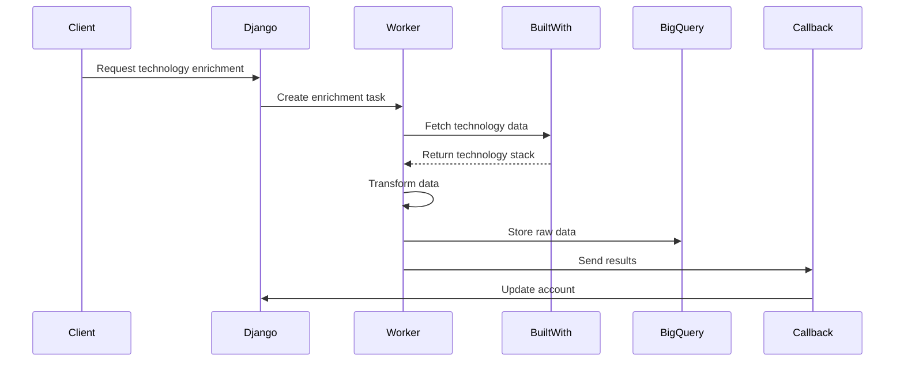

# BuiltWith Technology Enrichment Implementation Plan

## Overview

Add a new enrichment type to fetch and analyze technology stack data from BuiltWith API for account websites. This will help understand what technologies companies are using, which can be valuable for sales and targeting.

## 1. Model Changes

### Add to EnrichmentType in `api/django_app/app/models/account_enrichment.py`:
```python
TECHNOLOGY_INFO = 'technology_info', 'Technology Stack Information'
```

## 2. New Task Implementation

Create new file: `workers/tasks/technology_enrichment.py`

### Key Components:
1. TechnologyEnrichmentTask class inheriting from AccountEnrichmentTask
2. Integration with BuiltWith API
3. Data transformation and structuring
4. Error handling and retries
5. Result storage in BigQuery

### Data Structure:
```python
class TechnologyData:
    categories: Dict[str, List[str]]  # e.g. {"Analytics": ["Google Analytics", "Hotjar"]}
    first_detected: Dict[str, str]    # When each technology was first seen
    last_detected: Dict[str, str]     # Last detection date
    confidence_score: float           # Confidence in the detection
```

## 3. Implementation Steps

1. **Environment Setup**
   - Add BUILTWITH_API_KEY to environment variables
   - Update .env.example and documentation

2. **Service Implementation**
   - Create BuiltWithService class in services/builtwith_service.py
   - Implement API calls with retry logic
   - Add caching using APICacheService

3. **Task Implementation**
   - Create TechnologyEnrichmentTask
   - Implement execute() method
   - Add error handling and logging
   - Structure data for BigQuery storage

4. **Integration**
   - Update account enrichment trigger logic
   - Add new enrichment type to callback handler
   - Update account model to properly store technology data

## 4. API Flow



## 5. Implementation Details

### BuiltWith Service
```python
class BuiltWithService:
    def __init__(self, cache_service: APICacheService):
        self.api_key = os.getenv('BUILTWITH_API_KEY')
        self.cache_service = cache_service
        
    async def get_technology_profile(self, domain: str) -> Dict:
        # Implementation with caching and retries
```

### Technology Enrichment Task
```python
class TechnologyEnrichmentTask(AccountEnrichmentTask):
    ENRICHMENT_TYPE = 'technology_info'
    
    def __init__(self, callback_service):
        super().__init__(callback_service)
        self.builtwith_service = BuiltWithService(self.cache_service)
        
    async def execute(self, payload: Dict[str, Any]) -> Tuple[Dict[str, Any], Dict[str, Any]]:
        # Implementation
```

## 6. Testing Plan

1. **Unit Tests**
   - BuiltWithService API calls
   - Data transformation logic
   - Error handling

2. **Integration Tests**
   - Full enrichment flow
   - Caching behavior
   - Callback processing

3. **Error Cases**
   - API failures
   - Invalid domains
   - Rate limiting

## 7. Monitoring and Metrics

1. **Key Metrics to Track**
   - API success rate
   - Average enrichment time
   - Cache hit rate
   - Error distribution
   - Technology detection confidence scores

2. **Logging**
   - API call details
   - Transformation steps
   - Error details
   - Performance metrics

## 8. Future Enhancements

1. **Technology Change Detection**
   - Track technology stack changes over time
   - Alert on significant changes

2. **Technology Categories**
   - Group technologies by business function
   - Calculate technology maturity scores

3. **Competitive Analysis**
   - Compare technology stacks across accounts
   - Identify technology trends in industries

## 9. Security Considerations

1. **API Key Management**
   - Secure storage in environment variables
   - Regular key rotation

2. **Data Privacy**
   - Handle sensitive technology information
   - Implement appropriate access controls

3. **Rate Limiting**
   - Respect BuiltWith API limits
   - Implement backoff strategies

## 10. Documentation Updates Needed

1. **API Documentation**
   - New enrichment type
   - Response format
   - Error codes

2. **Deployment Guide**
   - Environment variables
   - API key setup
   - Cache configuration

3. **User Guide**
   - How to trigger enrichment
   - Understanding technology data
   - Interpreting confidence scores