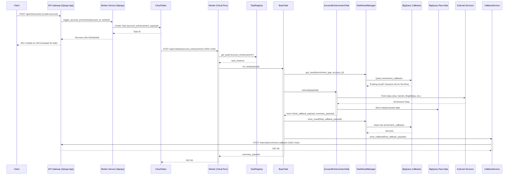
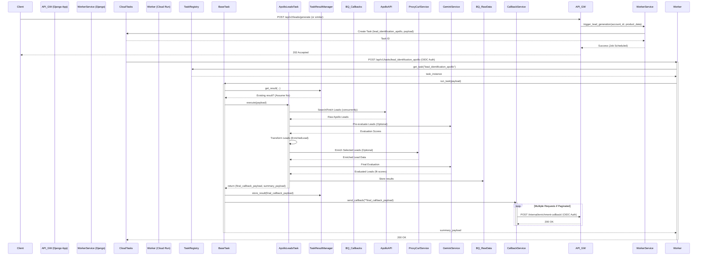
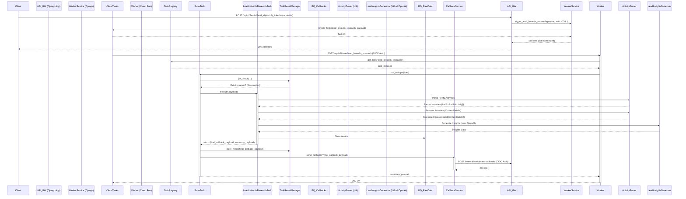
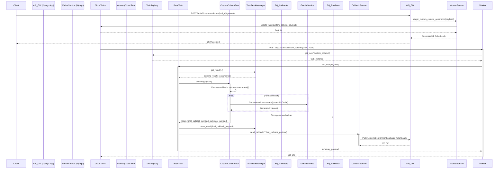

# Code Description of Userport Workers
*Updated based on code as of Apr 16, 2025*

**1. Overview**

The code implements a set of background workers designed to enrich account and lead data, generate leads, and compute custom data points using AI. It primarily leverages external APIs (LinkedIn via proxies, Apollo, BrightData, BuiltWith), AI models (Gemini, OpenAI), and web scraping/parsing techniques. The system is built around Google Cloud Tasks for asynchronous job queuing, with a FastAPI web application serving as both the API endpoint for creating tasks and the worker processing those tasks. The core goals are to provide asynchronous, scalable, reliable, and **idempotent** data enrichment and generation.

**2. Architecture**

The system follows a microservices-oriented, event-driven architecture:

*   **API (FastAPI):** Exposes endpoints for creating tasks (`/tasks/create/{task_name}`), checking task status (`/tasks/{job_id}/status`), listing failed tasks (`/tasks/failed`), and triggering retries (`/tasks/{job_id}/retry`). It also serves as the execution endpoint called by Cloud Tasks (`/tasks/{task_name}`).
*   **Task Queue (Google Cloud Tasks):** Queues tasks requested via the API for asynchronous execution. Decouples the API from potentially long-running processes.
*   **Workers (FastAPI + Cloud Run):** The core processing units deployed on Cloud Run. They receive task execution requests from Cloud Tasks (authenticated via OIDC), execute the business logic defined in `tasks/`, interact with external services and BigQuery, and send results back via callbacks.
*   **Data Storage (BigQuery):**
    *   `account_data`: Stores structured, enriched account information (potentially incorporating versioning/history).
    *   `enrichment_raw_data`: Stores raw data payloads from external sources and intermediate processing steps, along with job status and error details.
    *   `enrichment_callbacks`: Stores the **final, successful callback payload** for each task execution (`(job_id, account_id/lead_id)`) to ensure **idempotency**.
    *   `api_request_cache`: Caches responses from external APIs (ProxyCurl, BuiltWith, Apollo) to reduce costs and latency.
    *   `ai_prompt_cache`: Caches responses from AI models (Gemini, OpenAI) to reduce costs and latency.
*   **External Services:**
    *   **ProxyCurl:** Used for retrieving LinkedIn profile data (people and companies).
    *   **Jina AI:** Provides web search and website content parsing/summarization.
    *   **Gemini AI (Google):** Used for text generation, analysis, structured data extraction, and potentially search.
    *   **OpenAI:** Used for text generation, analysis, and potentially search.
    *   **Bright Data:** Collects company data, including LinkedIn profiles and posts.
    *   **Apollo.io:** Used for searching and retrieving lead and company data.
    *   **BuiltWith:** Provides technology stack information for websites.
    *   **Django Callback Service:** The main Userport application receives completion/failure callbacks from the workers (authenticated via OIDC).
*   **Key Architectural Features:**
    *   **Idempotency:** The `TaskResultManager` checks the `enrichment_callbacks` table before executing a task. If a successful result for the same `(job_id, entity_id)` exists, it resends the stored callback instead of reprocessing.
    *   **API/AI Caching:** `APICacheService` and `AICacheService` leverage BigQuery tables to cache responses from external APIs and AI models, significantly reducing redundant calls.
    *   **Structured Logging:** Uses `loguru` for JSON-formatted logs suitable for GCP Cloud Logging. Includes automatic context propagation (`trace_id`, `account_id`, `task_name`) across async tasks and threads.
    *   **Connection Pooling:** Uses `utils.connection_pool.ConnectionPool` for managing `httpx` connections efficiently, especially for the callback service and API cache interactions.

**3. Technologies**

*   **Python 3.11:** The primary programming language.
*   **FastAPI:** Modern, high-performance web framework for the API and worker endpoints.
*   **Uvicorn:** ASGI server used to run the FastAPI application (configured for 4 workers in Docker).
*   **Google Cloud Tasks:** Fully managed task queue service. (`google-cloud-tasks`)
*   **Google Cloud Run:** Serverless container execution environment.
*   **Google BigQuery:** Fully managed, serverless data warehouse for raw data, job status, callbacks, and caching. (`google-cloud-bigquery`)
*   **Pydantic:** Data validation, serialization, and settings management using Python type annotations.
*   **httpx:** Asynchronous HTTP client used for interacting with external services and the Django callback.
*   **google-generativeai:** Official Python client for Google's Gemini models. (`google-genai`)
*   **openai:** Library to access the OpenAI API.
*   **Beautiful Soup (bs4):** HTML parsing library (used within `utils/activity_parser.py`).
*   **Markdownify:** Converts HTML to Markdown (used within `utils/activity_parser.py`).
*   **tldextract:** Accurately separates URL components for domain extraction.
*   **loguru:** Advanced logging library providing structured logging and easier configuration.
*   **Docker:** Containerization for packaging and deploying the application.
*   **OIDC (OpenID Connect):** Used for secure authentication between Cloud Tasks/Worker and the Django callback endpoint.

**4. Data Models (Pydantic - `models/`)**

The code defines numerous Pydantic models to represent data structures:

*   **`models.accounts`:** `AccountInfo`, `Financials`, `RecentDevelopments`, `WebSearchResult`, `LinkedInPost`, `BrightDataAccount`, `SearchApolloOrganizationsResponse`.
*   **`models.leads`:** `ApolloLead`, `SearchApolloLeadsResponse`, `ProxyCurlPersonProfile`, `EnrichedLead`, `EvaluatedLead`, `EvaluateLeadsResult`.
*   **`models.lead_activities`:** `LinkedInActivity`, `ContentDetails`, `LeadResearchReport`, `OpenAITokenUsage`.
*   **`models.builtwith`:** `BuiltWithApiResponse`, `TechnologyProfile`, `EnrichmentResult` (specific to BuiltWith enrichment).
*   **`models.common`:** `UserportPydanticBaseModel` (base for others).
*   **`models.custom_column_generation_task`:** `CustomColumnValue` (defined within the task file, might move to models).

**5. Services (`services/`)**

*   **`services.task_manager.TaskManager`:** Manages Cloud Tasks creation and uses `BigQueryService` to retrieve job status.
*   **`services.task_registry.TaskRegistry`:** Singleton registry to look up task implementations by name.
*   **`services.bigquery_service.BigQueryService`:** Handles interactions with BigQuery tables (`account_data`, `enrichment_raw_data`).
*   **`services.task_result_manager.TaskResultManager`:** **Crucial for Idempotency.** Manages storing and retrieving final, successful task results in the `enrichment_callbacks` BigQuery table. Includes logic for handling large, batched results.
*   **`services.ai_service.AIServiceFactory`:** Creates instances of AI services (`GeminiService`, `OpenAIService`).
*   **`services.ai_service.AIService` (and implementations `GeminiService`, `OpenAIService`):** Abstract base class and concrete implementations for AI interactions (content generation, search). Integrates with `AICacheService`.
*   **`services.ai_service.AICacheService`:** Caches AI prompts and responses in BigQuery to reduce costs and latency.
*   **`services.api_cache_service.APICacheService`:** Generic caching layer for external API calls using BigQuery. Used by ProxyCurl, BuiltWith, Apollo services.
*   **`services.proxycurl_service.ProxyCurlService`:** Wraps ProxyCurl API calls (person profile, company profile, employee search). Uses `APICacheService`.
*   **`services.jina_service.JinaService`:** Wraps Jina AI API calls (Reader API for URL content, Search API).
*   **`services.brightdata_service.BrightDataService`:** Wraps Bright Data API calls for company data collection.
*   **`services.builtwith_service.BuiltWithService`:** Wraps BuiltWith API calls for technology stack information. Uses `APICacheService`.
*   **`services.apollo_service` (Implied by `tasks.generate_leads_apollo`):** Interacts with Apollo.io API for searching leads and organizations. Uses `APICacheService`.
*   **`services.django_callback_service.CallbackService`:** Handles sending authenticated completion/failure callbacks to the Django application using OIDC. Uses `ConnectionPool`.
*   **`services.django_callback_service_paginated.PaginatedCallbackService`:** Wraps `CallbackService` to automatically handle pagination for large callback payloads (e.g., lead lists).
*   **`services.ai_market_intel_service.AICompanyIntelService`:** Uses AI Search capabilities (like Gemini/OpenAI) to gather market intelligence (competitors, customers, recent events).

**6. Utilities (`utils/`)**

*   **`loguru_setup.py`:** Configures `loguru` for structured JSON logging, intercepts standard logging, handles exceptions, and crucially, sets up **context propagation** using `contextvars` (`trace_id`, `account_id`, `task_name`) across async tasks and threads. Provides `set_trace_context`.
*   **`async_utils.py`:** Provides `to_thread`, `to_io_thread`, `to_cpu_thread` decorators and `run_in_thread` function to run synchronous code in separate thread pools (`io`, `cpu`) while **preserving log context**. Includes `shutdown_thread_pools`.
*   **`connection_pool.py`:** A manager for `httpx.AsyncClient` connections, ensuring efficient reuse and limiting concurrent connections.
*   **`retry_utils.py`:** Provides `@with_retry` decorator for implementing retry logic with exponential backoff and jitter. Defines `RetryableError`.
*   **`bigquery_json_encoder.py`:** Custom JSON encoder (`safe_json_dumps`) for handling BigQuery-specific data types (datetime, date, Enum, bytes).
*   **`website_parser.py`:** Uses Jina's Reader API and Gemini to fetch/parse website content for customers and technologies.
*   **`activity_parser.py`:** Parses LinkedIn activity HTML (posts, comments, reactions) into structured `LinkedInActivity` objects. Uses `BeautifulSoup` and `markdownify`. Also uses AI for date extraction and content analysis.
*   **`lead_insights_gen.py`:** Generates insights about a lead (personality, interests, outreach recommendations) from their activities using AI.
*   **`role_pattern_generator.py`:** Uses Gemini AI to generate regex patterns for matching role titles based on examples.
*   **`account_info_fetcher.py`:** Fetches and structures basic account information using a combination of Jina AI Search, BuiltWith, and Bright Data. Uses AI for selecting the correct profile.
*   **`url_utils.py`:** Helper (`tldextract`) to extract a domain from a URL and compare LinkedIn URLs robustly.
*   **`json_utils.py`:** Basic JSON serialization utilities (likely superseded by `bigquery_json_encoder`).
*   **`token_usage.py`:** Dataclass `TokenUsage` for tracking AI token consumption.

**7. Tasks (`tasks/`)**

Tasks are the core units of work, inheriting from `BaseTask`.

*   **`tasks.base.BaseTask`:** Abstract base class. Defines common methods (`create_task_payload`, `execute`, `run_task`). **Crucially integrates `TaskResultManager` in `run_task` for idempotency**: checks for existing completed results *before* calling `execute`. Defines the `(result, summary)` return pattern for `execute`.
*   **`tasks.enrichment_task.AccountEnrichmentTask`:** A marker base class, likely for grouping account-related tasks.
*   **`tasks.account_enhancement.AccountEnhancementTask`:** Enhances account data by:
    *   Using `AccountInfoFetcher` (which uses BuiltWith, Jina Search, BrightData, AI).
    *   Fetching company profile from Jina AI.
    *   Extracting structured data using Gemini AI.
    *   Generating a business summary using Gemini AI.
    *   Parsing website for customers/technologies using `WebsiteParser`.
    *   Fetching tech stack via `BuiltWithService`.
    *   Fetching market intelligence (competitors, customers, events) via `AICompanyIntelService`.
    *   Storing results in BigQuery (`enrichment_raw_data`).
    *   Returns final callback payload (`result`) and a summary dict.
*   **`tasks.generate_leads_apollo.ApolloLeadsTask`:** Finds leads for an account using the Apollo API:
    *   Fetches Apollo Organization ID.
    *   Searches for leads in Apollo concurrently.
    *   Performs initial AI-based pre-evaluation (`pre_evaluate_apollo_leads`) to identify promising leads for enrichment.
    *   Transforms Apollo leads to `EnrichedLead` model.
    *   Optionally enriches selected leads using `ProxyCurlService`.
    *   Performs final AI evaluation (`_evaluate_leads_v2`) using Gemini.
    *   Stores results in BigQuery.
    *   Returns final callback payload (`result`) potentially paginated and a summary dict.
*   **`tasks.lead_linkedin_research_task.LeadLinkedInResearchTask`:** Generates a detailed lead research report from provided LinkedIn activity HTML:
    *   Parses activity HTML (posts, comments, reactions) using `utils.activity_parser.LinkedInActivityParser`.
    *   Extracts key insights (summaries, category, people mentioned) using `utils.lead_insights_gen.LeadInsights` (which uses OpenAI).
    *   Stores results in BigQuery.
    *   Returns final callback payload (`result`) and a summary dict.
*   **`tasks.custom_column_generation_task.CustomColumnTask`:** Generates values for custom columns defined in the Django app:
    *   Receives `column_config` and `context_data`.
    *   Processes entities (accounts/leads) in batches using `asyncio.gather` and a semaphore for concurrency control.
    *   Uses Gemini AI (`_generate_column_value`) to generate the value based on context and column definition. Supports using web search via AI config.
    *   Stores results in BigQuery.
    *   Returns final callback payload (`result`) and a summary dict.

**8. API (`api/routes.py`)**

*   **`POST /api/v1/tasks/create/{task_name}`:** Creates a new task in the Cloud Tasks queue via `TaskManager`. Requires task payload. Sets trace context.
*   **`POST /api/v1/tasks/{task_name}`:** The endpoint called by Cloud Tasks to execute a task.
    *   Authenticates the request (implicitly handled by Cloud Run/IAP/OIDC).
    *   Extracts Cloud Tasks headers (e.g., `X-CloudTasks-QueueName`, `X-CloudTasks-TaskRetryCount`).
    *   Sets trace context using payload data.
    *   Looks up the task implementation using `TaskRegistry`.
    *   Calls the task's `run_task` method, which handles idempotency and execution.
    *   Returns the result from `run_task`. Uses `DateTimeEncoder`.
*   **`GET /api/v1/tasks/{job_id}/status`:** Retrieves the status of a specific job using `TaskManager` (which queries BigQuery).
*   **`GET /api/v1/tasks/failed`:** Lists failed tasks using `TaskManager` (queries BigQuery), with filtering options.
*   **`POST /api/v1/tasks/{job_id}/retry`:** Retries a failed task. Gets status, validates retryability, and creates a *new* task using `TaskManager` with an incremented attempt number. *Currently hardcoded to retry `account_enhancement` task - needs generalization.*

**9. Main Application (`main.py`)**

*   Initializes `loguru` logging (structured JSON format, context propagation).
*   Sets up the FastAPI application with a `lifespan` manager.
*   **Startup:** Initializes `CallbackService`, registers tasks via `TaskRegistry`, sets up context-preserving task factory.
*   **Shutdown:** Cleans up `CallbackService` connection pool and shuts down `asyncio` thread pools (`shutdown_thread_pools`).
*   Includes `logging_middleware` for capturing request/response details, exceptions, and adding trace context (`trace_id`).
*   Includes the API router (`api.routes.router`).
*   Provides a `/health` check endpoint.

**10. Scripts (`scripts/`)**

*   **`scripts/bigquery_setup.sh`**: Sets up BigQuery dataset (`userport_enrichment`) and tables (`account_data`, `enrichment_raw_data`).
*   **`scripts/schemas/`**: Contains JSON schema files for the BigQuery tables created by the setup script.
*   **`scripts/update_to_loguru.py`**: Utility script to refactor code from standard `logging` to `loguru`.
*   **`scripts/test_loguru.py`**: Test script for `loguru` setup.
*   **Note:** The schema for `enrichment_callbacks`, `api_request_cache`, and `ai_prompt_cache` tables (used for idempotency and caching) are not explicitly in the `scripts/schemas` folder but are created/managed by `TaskResultManager`, `APICacheService`, and `AICacheService` respectively. Their structure includes keys, request/response data, timestamps, and metadata.

**11. Deployment & Infrastructure**

*   **Google Cloud Run:** The application is designed as a container deployed on Cloud Run.
*   **Google Cloud Tasks:** Used for asynchronous task queuing and execution triggering.
*   **Google BigQuery:** Primary data store for raw data, job status, idempotency callbacks, and API/AI caching.
*   **Docker:** Containerization (`Dockerfile`) for packaging. Uses Python 3.11 slim image.
*   **Environment Variables:** Configuration managed via environment variables (`.env` locally, Cloud Run secrets/env vars in deployment).
*   **Service Account & Workload Identity:** Uses a service account for GCP interactions. Leverages Workload Identity when running on GKE/Cloud Run for secure, keyless authentication to other Google Cloud services (like Cloud Tasks, BigQuery).
*   **OIDC (OpenID Connect):** Used by Cloud Tasks to authenticate its requests to the Cloud Run worker endpoint, and by the worker to authenticate callbacks to the Django application.

**12. Sequence Diagrams (Mermaid)**

**A. Account Enhancement Flow (Updated)**

**B. Lead Generation Flow (Apollo - Updated)**

**C. Lead Research Flow (LinkedIn Activity - Updated)**

**D. Generate Custom Column Values (New)**

*(Removed Apollo generation diagram E as it was a duplicate of B)*

**13. Key Features and Considerations**

*   **Idempotency:** Task execution is idempotent using `TaskResultManager` and the `enrichment_callbacks` BigQuery table. Retries or duplicate calls for the same job/entity won't re-process if already completed successfully.
*   **API/AI Caching:** Reduces costs and improves latency by caching responses from external APIs (ProxyCurl, BuiltWith, Apollo) and AI models (Gemini, OpenAI) in BigQuery using `APICacheService` and `AICacheService`.
*   **Scalability:** Leverages Cloud Run and Cloud Tasks for horizontal scaling based on load. Concurrency within tasks is managed using `asyncio` and semaphores.
*   **Asynchronous Processing:** Tasks are executed asynchronously via Cloud Tasks, preventing blocking of the main API.
*   **Structured Logging:** Uses `loguru` for detailed, structured JSON logs, including automatic trace context (`trace_id`, `account_id`, `task_name`) propagation across async/thread boundaries.
*   **Error Handling:** Uses `@with_retry` decorator for retries with exponential backoff. Stores detailed error information in BigQuery (`enrichment_raw_data`). Uses custom `TaskError` in API.
*   **Modularity:** Code is structured into services, tasks, utils, and models. New enrichment tasks can be added by inheriting from `BaseTask`.
*   **Configuration:** Environment variables control API keys, database connections, queue names, service URLs, etc.
*   **Authentication:** OIDC secures communication between Cloud Tasks and the worker, and between the worker and the Django callback endpoint. Workload Identity used in GCP environments.
*   **Connection Pooling:** `ConnectionPool` manages HTTP connections efficiently for services making frequent outbound requests (Callback, API Cache).
*   **Paginated Callbacks:** `PaginatedCallbackService` automatically splits large callback payloads (e.g., lead lists) into multiple requests to avoid size limits.
*   **Task Abstraction:** `BaseTask` provides a common interface and handles core logic like idempotency checks and result storage.
*   **AI Integration:** Uses `AIServiceFactory` to abstract AI provider implementations (Gemini, OpenAI), supporting content generation and search.
