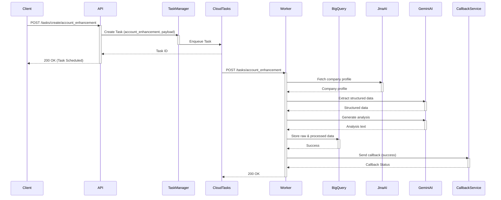
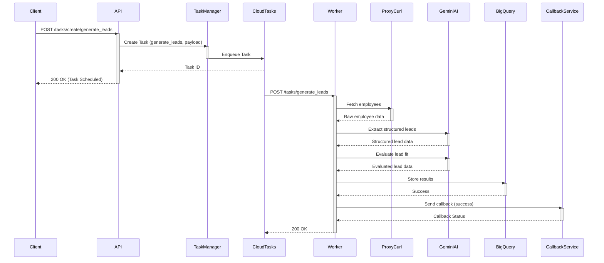
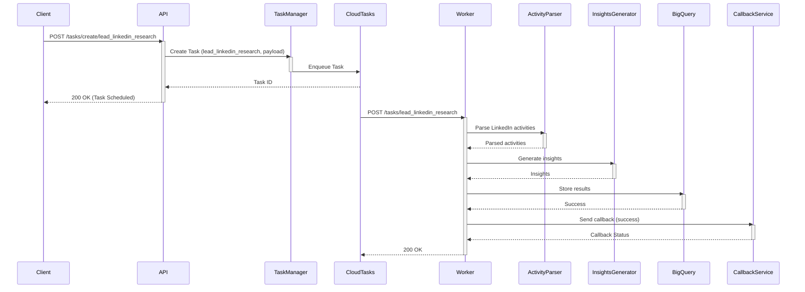
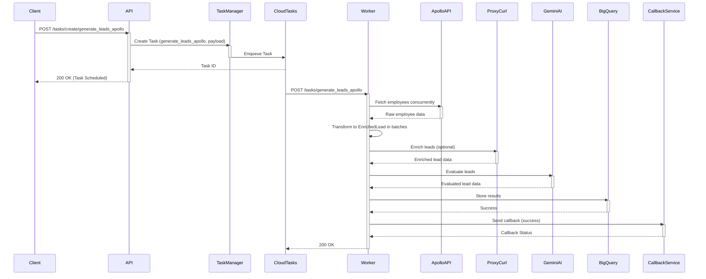
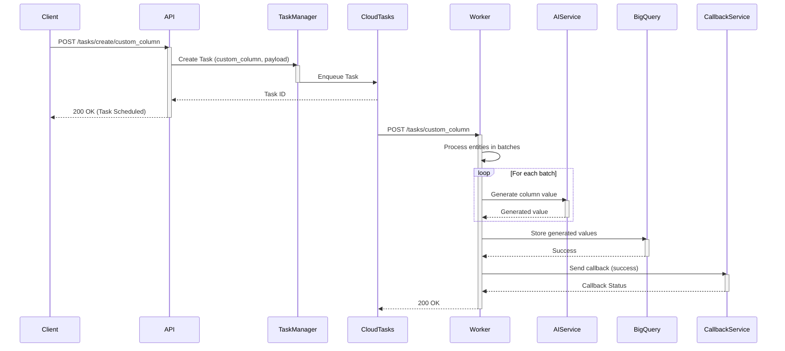

# Code Description of Userport Workers
*As generated by AI*

**1. Overview**

The code implements a set of background workers designed to enrich account and lead data, primarily leveraging LinkedIn and other web sources. It's built around a task queue system (Google Cloud Tasks), with a FastAPI web application serving as both the API endpoint for creating tasks and the worker processing those tasks.  The core idea is to provide asynchronous, scalable data enrichment.

**2. Architecture**

The system follows a microservices-oriented, event-driven architecture:

*   **API (FastAPI):**  Exposes endpoints for creating tasks, checking task status, and triggering retries.  This is the entry point for external systems.
*   **Task Queue (Google Cloud Tasks):**  Queues tasks to be executed asynchronously.  This decouples the API from the potentially long-running enrichment processes.
*   **Workers (FastAPI + Cloud Run):**  Processes tasks pulled from the queue.  These workers perform the actual data enrichment logic.  Cloud Run provides scalable, serverless execution.
*   **Data Storage (BigQuery):**  Stores both raw and processed data.  BigQuery is chosen for its scalability and analytical capabilities.
*   **External Services:**
    *   **ProxyCurl:**  Used for retrieving LinkedIn profile data (both for leads and companies).
    *   **Jina AI:** Provides web search (for finding LinkedIn URLs) and website parsing capabilities.
    *   **Gemini AI (Google):**  Used for text generation, analysis, and structured data extraction.
    *   **OpenAI:**  Used for generating insights, outreach recommendations, and personality analysis.
    * **Bright Data:** Collects company data.
    * **Django Callback service**: Used for sending completion callbacks to Django app.

**3. Technologies**

*   **Python 3.11:**  The primary programming language.
*   **FastAPI:**  A modern, high-performance web framework for building APIs.
*   **Uvicorn:**  An ASGI server used to run the FastAPI application.
*   **Google Cloud Tasks:**  A fully managed task queue service.
*   **Google Cloud Run:**  A serverless container execution environment.
*   **Google BigQuery:**  A fully managed, serverless data warehouse.
*   **Pydantic:**  Data validation and settings management using Python type annotations.
*   **httpx:** An asynchronous HTTP client.
*   **google-generativeai:** Official Python client for Google's Gemini models.
*   **openai:** Library to access the openAI API.
*   **Beautiful Soup (bs4):**  HTML parsing library.
*   **Markdownify:**  Converts HTML to Markdown.
*   **tldextract:** Accurately separates a URL's subdomain, domain, and suffix components.
*   **python-json-logger:**  Logs in JSON format, suitable for structured logging in GCP.
*   **Docker:**  Containerization for packaging and deploying the application.

**4. Data Models (Pydantic)**

The code defines several Pydantic models to represent data structures:

*   **`models.accounts`:**
    *   `AccountInfo`: Core account information (name, website, LinkedIn URL, employee count, etc.).
    *   `Financials`: Funding details (public and private).
    *   `RecentDevelopments`: Company updates, such as LinkedIn posts and web search results.
    * `BrightDataAccount`: Represents account information fetched from Bright Data.

*   **`models.leads`:**
    *   `ApolloLead`: Lead data as returned by the Apollo API.
    *  `SearchApolloLeadsResponse`:  Encapsulates the entire response from the Apollo search API.
    *   `ProxyCurlPersonProfile`:  Structured data from the ProxyCurl API for person profiles.
    *   `EnrichedLead`:  A unified model combining data from various sources (e.g., Apollo, ProxyCurl, internal processing).
    *   `EvaluatedLead`: Represents the final evaluation of a lead, including a fit score.
    *   `EvaluateLeadsResult`: The complete set of `EvaluatedLead` objects.

*   **`models.lead_activities`:**
    *   `LinkedInActivity`:  Represents a single LinkedIn activity (post, comment, reaction).
    *   `ContentDetails`:  Processed and analyzed content from a LinkedIn activity.
    *   `LeadResearchReport`:  Comprehensive lead research report, including insights and personalized emails.
    *   `OpenAITokenUsage`: Tracks token usage for OpenAI API calls.

*  **`models.common`:**
    * `UserportPydanticBaseModel`: A base model for all the Userport models.

* **`CustomColumnValue`:** Model for custom column value.

**5. Services**

*   **`services.task_manager.TaskManager`:**  Manages Cloud Tasks creation, retrieval, and retry logic.
*   **`services.bigquery_service.BigQueryService`:** Handles all interactions with BigQuery. This includes storing raw and processed data, as well as error information.
*   **`services.ai_service.AIService` (and implementations `GeminiService`, `OpenAIService`):** Abstract base class for AI interactions.  Concrete implementations wrap the Gemini and OpenAI APIs.  Provides retries and token usage tracking.
*   **`services.proxycurl_service.ProxyCurlService`:**  Wraps calls to the ProxyCurl API for fetching LinkedIn data.
*   **`services.django_callback_service.CallbackService`:**  Handles sending completion/failure callbacks to a Django application. This supports authentication via OIDC (OpenID Connect) and uses a connection pool for efficiency.
* **`services.django_callback_service_paginated.PaginatedCallbackService`:** Handles pagination of large callback payloads
* **`services.task_registry.TaskRegistry`:** Task registery for registering tasks.
* **`services.api_cache_service.APICacheService`:** API cache for external calls.
* **`services.jina_service.JinaService`:** Encapsulates calls to Jina AI for web search and site summarization
*   **`services.brightdata_service.BrightDataService`:** Wraps calls to the BrightData API for account data retrieval.

**6. Utilities (`utils/`)**

*   **`retry_utils.py`:**  Provides a `@with_retry` decorator for implementing retry logic with exponential backoff.
*   **`bigquery_json_encoder.py`:** Custom JSON encoder for handling BigQuery-specific data types (datetime, date, Enum).
*   **`website_parser.py`:** Uses Jina's Reader API to fetch and parse website content, specifically to extract customer lists and used technologies.
*   **`activity_parser.py`:** Parses LinkedIn activity HTML (posts, comments, reactions) into structured data.
*   **`lead_insights_gen.py`:** Generates insights about a lead (personality, areas of interest, engagement) from their LinkedIn activities.
*  **`role_pattern_generator.py`:** Uses Gemini AI to generate regex patterns for role titles.
*   **`account_info_fetcher.py`:** Fetches and structures basic account information using Jina AI for search, Bright Data for company data, and Gemini for validation and analysis.
* **`url_utils.py`:** Helper to extract a domain from a URL.
*   **`json_utils.py`:** Custom JSON serialization for datetime objects.
*   **`connection_pool.py`:** Connection pooling for `httpx`

**7. Tasks (`tasks/`)**

Tasks are the core units of work. Each task inherits from `tasks.base.BaseTask`.

*   **`tasks.base.BaseTask`:**  Abstract base class for all tasks.  Defines common methods like `execute`, `create_task_payload`, `run_task`. Includes integration with `TaskResultManager` for idempotency (avoiding duplicate execution for the same input).

*   **`tasks.account_enhancement.AccountEnhancementTask`:**  Enhances account data by:
    *   Fetching the company profile from Jina AI.
    *   Extracting structured data (company name, industry, location, etc.) using Gemini AI.
    *   Generating a business summary using Gemini AI.
    *   Storing both raw and processed data in BigQuery.

*   **`tasks.generate_leads_task.GenerateLeadsTask`:**  Identifies potential leads for an account by:
    *   Searching for employees on LinkedIn using ProxyCurl.
    *   Structuring the raw employee data using Gemini AI.
    *   Evaluating lead fit based on product and persona criteria using Gemini AI.
    *   Storing results in BigQuery.

*   **`tasks.lead_linkedin_research_task.LeadLinkedInResearchTask`:** Generates a detailed lead research report by:
    *   Parsing LinkedIn activity HTML (posts, comments, reactions) using `utils.activity_parser.LinkedInActivityParser`.
    *   Extracting key insights (content summary, category, people mentioned, etc.) using `utils.lead_insights_gen.LeadInsights`.
    *   Storing the results in BigQuery.

*   **`tasks.generate_leads_apollo.ApolloLeadsTask`:**  Finds leads from Apollo API, structures them, enriches them (optionally with Proxycurl) and evaluates the leads for fit.
* **`tasks.custom_column_generation_task.CustomColumnTask`:** Generate column values for custom columns using Gemini AI.

* **`tasks.enrichment_task.AccountEnrichmentTask`:**  Base class for all enrichment tasks.

**8. API (`api/routes.py`)**

*   **`POST /api/v1/tasks/create/{task_name}`:** Creates a new task in the Cloud Tasks queue.  The `task_name` determines which task class will be used. The payload is passed to the task's `create_task_payload` method.
*   **`POST /api/v1/tasks/{task_name}`:**  The endpoint that Cloud Tasks calls to execute a task. This endpoint is protected by OIDC authentication.
*   **`GET /api/v1/tasks/{job_id}/status`:** Retrieves the status of a specific job.
*   **`GET /api/v1/tasks/failed`:** Lists failed tasks, with options for filtering by date and retryability.
*   **`POST /api/v1/tasks/{job_id}/retry`:** Retries a failed task.

**9. Main Application (`main.py`)**

*   Initializes logging (structured JSON format for GCP).
*   Sets up the FastAPI application.
*   Registers API routes.
*   Handles startup events (like initializing the callback service).
*   Implements request logging middleware to capture request details and exceptions.

**10. Scripts**

* **`scripts/bigquery_setup.sh`**: Sets up BigQuery dataset and tables.
* `account_data` table: Stores structured account data.
* `enrichment_raw_data` table: Stores raw data from enrichment sources, processing details, and errors.
* `enrichment_callbacks` table:  Stores the final callback payload for each completed, successful task.  This is used for idempotency.
* **`scripts/schemas`**: Contains json schema files for the Bigquery tables.

**11. Deployment & Infrastructure**

*   **Google Cloud Run:** The application is designed to be deployed as a serverless container on Cloud Run.
*   **Google Cloud Tasks:** Used for asynchronous task execution.
*   **Google BigQuery:**  Used as the primary data store.
*   **Docker:** Containerization is used for packaging and deployment.
*   **Environment Variables:**  Configuration is managed through environment variables (e.g., API keys, database credentials, Cloud project IDs).
*   **Service Account:**  A service account is used for authentication with Google Cloud services.
*   **OIDC (OpenID Connect):**  Used to secure the callback endpoint.
*  **Workload Identity**: Used in cloud environment.

**12. Sequence Diagrams (Mermaid)**

**A. Account Enhancement Flow**

**B.  Lead Generation Flow**

**C.  Lead Research Flow (LinkedIn Activity)**

**D. Generate leads using Apollo API**

**E. Generate Custom Column Values**

**13. Key Features and Considerations**

*   **Idempotency:** The `TaskResultManager` and the use of BigQuery for storing results ensure that tasks are idempotent. If a task fails and is retried, it won't re-process data if a completed result is already stored.
*   **Scalability:**  Cloud Run and Cloud Tasks are designed for horizontal scalability.
*   **Error Handling:**  Comprehensive error handling with retries using the `@with_retry` decorator, structured logging, and storage of error details in BigQuery.
*   **Asynchronous Processing:**  Tasks are executed asynchronously, preventing blocking of the API.
*   **Modularity:**  The code is well-structured into services and tasks, making it easy to extend and maintain.  New enrichment tasks can be added by inheriting from `BaseTask`.
*   **Configuration:**  Environment variables are used for configuration, making it easy to deploy to different environments.
*   **Authentication:**  OIDC is used for secure communication with the Django callback service.
*   **API Caching:** An `APICacheService` is used to cache responses from external APIs (e.g., ProxyCurl).
*   **Paginated Callbacks:**  The `PaginatedCallbackService` handles splitting large callback payloads into multiple requests to avoid exceeding size limits.
*  **Connection Pooling:**  A `ConnectionPool` class is used to efficiently manage HTTP connections, reducing overhead.
